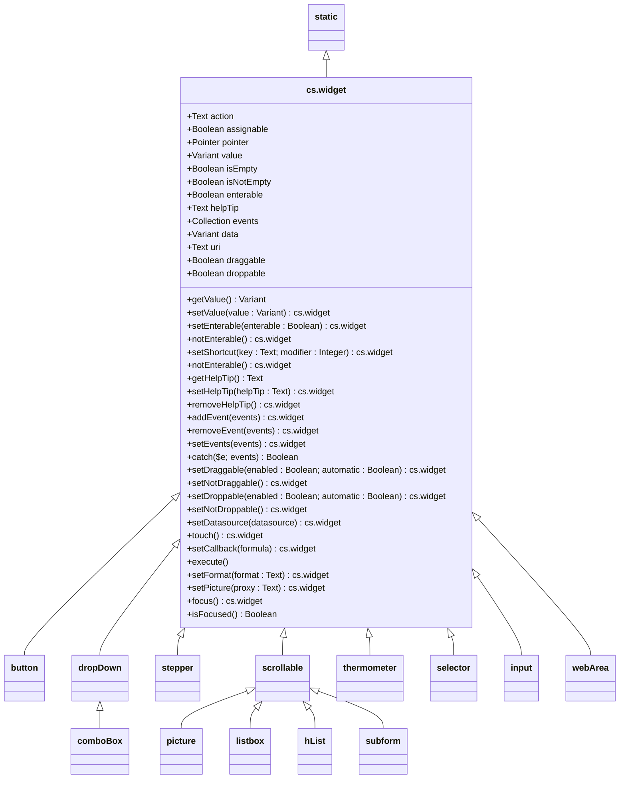

```mermaid
classDiagram 

static<|-- widget
    widget <|-- button
    widget <|-- dropDown
    widget <|-- stepper
    widget <|-- scrollable
    widget <|-- thermometer
    widget <|-- selector
    widget <|-- input
    widget <|-- webArea
    dropDown <|-- comboBox
    scrollable <|-- picture
    scrollable <|-- listbox
    scrollable <|-- hList
    scrollable <|-- subform

class widget["cs.widget"]{
	+Text action
	+Boolean assignable
	+Pointer pointer
	+Variant value
	+getValue() Variant
	+setValue(value : Variant) cs.widget
	+Boolean isEmpty
	+Boolean isNotEmpty
	+Boolean enterable
	+setEnterable(enterable : Boolean) cs.widget
	+notEnterable() cs.widget
	+setShortcut(key : Text; modifier : Integer) cs.widget
	+notEnterable() cs.widget
	+Text helpTip
	+getHelpTip() Text
	+setHelpTip(helpTip : Text) cs.widget
	+removeHelpTip() cs.widget
	+Collection events
	+addEvent(events) cs.widget
	+removeEvent(events) cs.widget
	+setEvents(events) cs.widget
	+catch($e; events) Boolean
	+Variant data
	+Text uri
	+Boolean draggable 
	+setDraggable(enabled : Boolean; automatic : Boolean) cs.widget
	+setNotDraggable() cs.widget
	+Boolean droppable 
	+setDroppable(enabled : Boolean; automatic : Boolean) cs.widget
	+setNotDroppable() cs.widget
	+setDatasource(datasource) cs.widget
	+touch() cs.widget
	+setCallback(formula) cs.widget
	+execute()
	+setFormat(format : Text) cs.widget
	+setPicture(proxy : Text) cs.widget
	+focus() cs.widget
	+isFocused() Boolean
}
```
