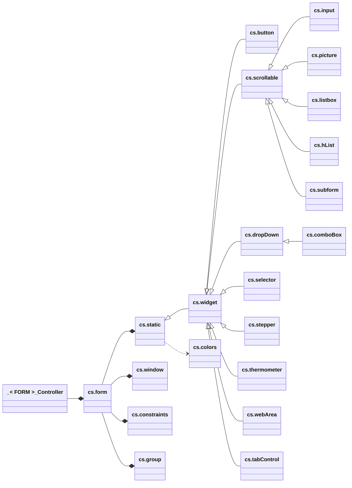

# UI Classes — diagram

> A `Function get xxx` is a computed attribute; when it is writable a matching
> `Function set xxx` also exists. Such accessors are shown as attributes below.

## Overview (synthetic view)

Inheritance hierarchy and composition from `cs.form`.



## Detailed view (complete API)

All public properties and functions of each class. Computed accessors
(`Function get` / `Function set`) are listed as attributes.

Members are ordered by purpose (identity/state, geometry/dimensions,
appearance, then functions grouped by theme — e.g. all instantiation
factories together, all move/resize helpers together). Each group is
separated by a blank line to make members easier to locate.

```mermaid
classDiagram
    direction LR

    _FORM_Controller --* form
    form --* static
    form --* widget
    form --* button
    form --* scrollable
    form --* input
    form --* dropDown
    form --* comboBox
    form --* selector
    form --* stepper
    form --* thermometer
    form --* tabControl
    form --* picture
    form --* listbox
    form --* hList
    form --* subform
    form --* webArea
    form --* window
    form --* constraints
    form --* group

    static <|-- widget
    widget <|-- button
    widget <|-- scrollable
    widget <|-- dropDown
    widget <|-- selector
    widget <|-- stepper
    widget <|-- thermometer
    widget <|-- webArea
    widget <|-- tabControl
    dropDown <|-- comboBox
    scrollable <|-- input
    scrollable <|-- picture
    scrollable <|-- listbox
    scrollable <|-- hList
    scrollable <|-- subform
    static ..> colors

    class _FORM_Controller["_< FORM >_Controller"] {
        +form : cs.form
        +init()
        +handleEvents(e : cs.evt)
        +onLoad()
        +update()
    }

    class form["cs.form"] {
        %% Identity / state
        +name : Text
        +isSubform : Boolean
        +toBeInitialized : Boolean
        +isMatrix : Boolean
        +fluentUI : Boolean
        +callback : Text
        %% Color scheme / appearance
        +colorScheme
        +focused : Text
        +highlight : Text
        +darkScheme : Boolean
        +lightScheme : Boolean
        +resourceScheme : Text
        +darkSuffix : Text
        %% Pages
        +pageNumber : Integer
        +page : Integer
        +pages : Object
        %% Geometry / resizing
        +rect : Object
        +horizontallyResizable : Boolean
        +verticallyResizable : Boolean
        +minWidth : Integer
        +maxWidth : Integer
        +minHeight : Integer
        +maxHeight : Integer
        %% Composed objects
        +window : cs.window
        +constraints : cs.constraints
        %% Container
        +containerName : Text
        +container : Object
        +containerInstance : Object
        +containerValue : Variant
        %% Context / entry order
        +entryOrder : Collection
        +context : Collection
        +current
        %% Child collections
        +events : Collection
        +formObjects : Collection
        +staticTexts : Collection
        +staticPictures : Collection
        +statics : Collection
        +subforms : Collection
        +instantiatedWidgets : Collection
        +instantiatedSubforms : Collection
        %% Timer / worker
        +deferedTimer : Integer
        +worker : Variant
        %% --- Lifecycle ---
        +init()
        +handleEvents(e : cs.evt)
        +onLoad()
        +update(stopTimer : Boolean)
        +onBoundVariableChange()
        +onOutsideCall()
        %% --- Context ---
        +saveContext()
        +restoreContext()
        +getContainerValue() Variant
        +setContainerValue(value)
        %% --- Focus / entry order ---
        +focus(widget)
        +removeFocus()
        +focusNext()
        +focusPrevious()
        +setEntryOrder(names : Collection)
        %% --- Color scheme ---
        +isSchemeModified() Boolean
        +resourceFromScheme(path : Text) Text
        %% --- Timer ---
        +setTimer(tickCount : Integer)
        +refresh(tickCount : Integer)
        +stopTimer()
        +deferTimer(id : Integer; tickCount : Integer)
        +clearDeferedTimer()
        %% --- Worker / messaging ---
        +callWorker(method; ...)
        +callMeBack(...)
        +callMe(method : Text; ...)
        +callChild(subform; method; ...)
        +spreadToChilds(message : Object)
        +callParent(eventCode : Integer)
        %% --- Events ---
        +setEvents(events)
        +appendEvents(events)
        +removeEvents(events)
        +postKeyDown(keyCode : Integer; modifier : Integer)
        %% --- Pages ---
        +setPageNames(names : Collection)
        +pageFromName(name : Text) Integer
        +goToPage(page; parent : Boolean)
        +firstPage(parent : Boolean)
        +lastPage(parent : Boolean)
        +nextPage(parent : Boolean)
        +previousPage(parent : Boolean)
        %% --- Cursor / drag & drop / misc ---
        +setCursor(cursor)
        +releaseCursor()
        +beginDrag(uri : Text; data; dragIcon : Picture)
        +getPasteboard(uri : Text) Variant
        +getSubformInstance(name : Text) Object
        +getScreenshot(page : Integer) Picture
        %% --- Sizing / resizing ---
        +setHorizontalResising(resize : Boolean; min : Integer; max : Integer)
        +setVerticalResising(resize : Boolean; min : Integer; max : Integer)
        +setSize(widget; hMargin : Integer; vMargin : Integer)
        %% --- Instantiation factories ---
        +Button(name : Text) cs.button
        +ComboBox(name : Text; data : Object) cs.comboBox
        +DropDown(name : Text; data : Object) cs.dropDown
        +Group(members; ...) cs.group
        +HList(name : Text; itemRef : Integer) cs.hList
        +Input(name : Text) cs.input
        +Listbox(name : Text) cs.listbox
        +Picture(name : Text; data) cs.picture
        +Scrollable(name : Text; values : Collection) cs.scrollable
        +Selector(name : Text; values : Collection) cs.selector
        +Static(name : Text) cs.static
        +Stepper(name : Text) cs.stepper
        +Subform(name : Text; events : Object; super : Object; form : Object) cs.subform
        +TabControl(name : Text; data; page : Integer) cs.tabControl
        +Thermometer(name : Text) cs.thermometer
        +WebArea(name : Text; data) cs.webArea
        +Widget(name : Text) cs.widget
    }

    class static["cs.static"] {
        %% Identity
        +name : Text
        +type : Integer
        +title : Text
        +class : Text
        %% Geometry / coordinates
        +width : Integer
        +height : Integer
        +left : Integer
        +top : Integer
        +right : Integer
        +bottom : Integer
        +rect : cs.rect
        +dimensions : cs.dimensions
        +coordinates : cs.coordinates
        +windowCoordinates : Object
        +initialPosition : cs.coordinates
        %% Resizing / moving
        +resizingOptions : Object
        +horizontallyResizable : Boolean
        +verticallyResizable : Boolean
        +horizontallyMovable : Boolean
        +verticallyMovable : Boolean
        %% State
        +enabled : Boolean
        +disabled : Boolean
        +visible : Boolean
        +hidden : Boolean
        %% Appearance
        +format : Text
        +colors : Object
        +foregroundColor : Variant
        +backgroundColor : Variant
        +altBackgroundColor : Variant
        +horizontalAlignment : Integer
        +verticalAlignment : Integer
        +font : Text
        +fontStyle : Integer
        +fontSize : Integer
        %% --- Title / definition ---
        +setTitle(title : Text) cs.static
        +jsonFormDefinition() Object
        %% --- Dimensions ---
        +setResizingOptions(horizontal : Integer; vertical : Integer)
        +setWidth(width : Integer) cs.static
        +setHeight(height : Integer) cs.static
        +setRect(width : Integer; height : Integer) cs.static
        +setDimensions(width : Integer; height : Integer) cs.static
        +getCoordinates() cs.coordinates
        +setCoordinates(left; top; right; bottom) cs.static
        %% --- Best size ---
        +bestSize(alignment; minWidth; maxWidth) cs.static
        +bestHeight(width : Integer) cs.static
        +getBestHeight(maxWidth : Integer) Integer
        +getBestWidth(maxWidth : Integer) Integer
        %% --- Move ---
        +moveHorizontally(offset : Integer) cs.static
        +moveLeft(offset : Integer) cs.static
        +moveRight(offset : Integer) cs.static
        +moveVertically(offset : Integer) cs.static
        +moveUp(offset : Integer) cs.static
        +moveDown(offset : Integer) cs.static
        %% --- Resize ---
        +resizeHorizontally(offset : Integer) cs.static
        +resizeVertically(offset : Integer) cs.static
        +resize(offset : Integer) cs.static
        +moveAndResizeHorizontally(offset; resize) cs.static
        +moveAndResizeVertically(offset; resize) cs.static
        %% --- Position backup / restore ---
        +updateCoordinates(left; top; right; bottom) cs.static
        +backupCoordinates() cs.static
        +restorePosition()
        %% --- State ---
        +enable(state : Boolean) cs.static
        +disable() cs.static
        +show(state : Boolean) cs.static
        +hide() cs.static
        %% --- Format / picture ---
        +setFormat(format : Text) cs.static
        +setPicture(proxy : Text) cs.static
        %% --- Colors ---
        +setColors(foreground; background; altBackground) cs.static
        +restoreForegroundColor()
        +restoreBackgroundColor()
        +restoreAltBackgroundColor()
        +removeBackgroundColor()
        +removeAltBackgroundColor()
        %% --- Alignment ---
        +alignLeft() cs.static
        +alignRight() cs.static
        +alignTop() cs.static
        +alignBottom() cs.static
        +alignCenter(vertical : Boolean) cs.static
        %% --- Font ---
        +setFont(font : Text) cs.static
        +setFontStyle(style : Integer) cs.static
        %% --- Group / misc ---
        +addToGroup(group : cs.group) cs.static
        +hiddenFromView() cs.static
        +duplicate(moveV; moveH; boundTo; newName) Object
    }

    class widget["cs.widget"] {
        %% Identity / state
        +name : Text
        +action : Text
        +uri : Text
        +newUI : Boolean
        +value : Variant
        +datasource
        +isEmpty : Boolean
        +isNotEmpty : Boolean
        +enterable : Boolean
        +contextMenu : Boolean
        +helpTip : Text
        +events : Collection
        +data : Variant
        +pointer : Pointer
        %% Drag & drop
        +draggable : Boolean
        +droppable : Boolean
        %% --- Datasource / value ---
        +setDatasource(datasource) cs.widget
        +getValue() Variant
        +setValue(value) cs.widget
        +clear() cs.widget
        %% --- Enterable ---
        +setEnterable(enterable : Boolean) cs.widget
        +notEnterable() cs.widget
        %% --- Shortcut ---
        +getShortcut() Object
        +setShortcut(key : Text; modifier : Integer) cs.widget
        %% --- Help tip ---
        +getHelpTip() Text
        +setHelpTip(helpTip : Text) cs.widget
        +removeHelpTip() cs.widget
        %% --- Events ---
        +addEvent(events) cs.widget
        +removeEvent(events) cs.widget
        +setEvents(events) cs.widget
        +catch(e; events) Boolean
        %% --- Data ---
        +setData(o : Object) cs.widget
        %% --- Drag & drop ---
        +setDraggable(enabled : Boolean; automatic : Boolean) cs.widget
        +setNotDraggable() cs.widget
        +setDroppable(enabled : Boolean; automatic : Boolean) cs.widget
        +setNotDroppable() cs.widget
        %% --- Callback / execution ---
        +setCallback(formula) cs.widget
        +execute()
        %% --- Focus / interaction ---
        +focus() cs.widget
        +isFocused() Boolean
        +touch() cs.widget
        +postClick()
    }

    class button["cs.button"] {
        %% Popup menu
        +linkedPopupMenu : Boolean
        +separatePopupMenu : Boolean
        %% Pictures
        +picture : Text
        +backgroundPicture : Text
        %% States / style
        +numStates : Integer
        +style : Integer
        +styleName : Text
        +horizontalMargin : Integer
        %% --- Popup menu ---
        +setLinkedPopupMenu() cs.button
        +setSeparatePopupMenu() cs.button
        +setNoPopupMenu() cs.button
        %% --- Pictures ---
        +setPicture(proxy : Text) cs.button
        +setBackgroundPicture(proxy : Text) cs.button
        %% --- States / style ---
        +setNumStates(states : Integer) cs.button
        +setStyle(style : Integer) cs.button
        +is3DButton(message : Text) Boolean
        %% --- Shortcut ---
        +highlightShortcut() cs.button
        +setShortcut(key : Text; modifier : Integer) cs.widget
    }

    class scrollable["cs.scrollable"] {
        %% Scrollbars
        +scroll
        +scrollbars : Object
        +horizontalScrollbar : Boolean
        +horizontalScrollbarAuto : Boolean
        +verticalScrollbar : Boolean
        +verticalScrollbarAuto : Boolean
        %% Scroll position
        +horizontalPosition : Integer
        +verticalPosition : Integer
        %% --- Scrollbars ---
        +getScrollbars() Object
        +setScrollbars(horizontal; vertical) cs.scrollable
        +setHorizontalScrollbar(display) cs.scrollable
        +setVerticalScrollbar(display) cs.scrollable
        +noScrollbar() cs.scrollable
        %% --- Scroll position ---
        +getScrollPosition() Variant
        +setScrollPosition(vertical; horizontal; firstPosition) cs.scrollable
    }

    class input["cs.input"] {
        %% State / options
        +asPassword : Boolean
        +autoSpellcheck : Boolean
        +dictionary : Object
        +filter : Text
        +placeholder : Text
        +modified : Boolean
        %% --- Backup / restore ---
        +backup(value) cs.input
        +restore()
        %% --- Selection highlighting ---
        +highlight(startSel : Integer; endSel : Integer) cs.input
        +highlightLastToEnd() cs.input
        +highlighted() Object
        +highlightingStart() Integer
        +highlightingEnd() Integer
        %% --- Filter / placeholder ---
        +setFilter(filter; sep : Text) cs.input
        +getFilter() Text
        +setPlaceholder(placeholder : Text) cs.input
        %% --- Misc ---
        +setEnterable(enterable : Boolean; focusable : Boolean) cs.input
        +swapDecimalSeparator()
        +truncateWithEllipsis(where : Integer; target : Text; char : Text)
    }

    class dropDown["cs.dropDown"] {
        %% Data
        +data : Object
        +values : Collection
        +value : Variant
        +index : Integer
        +placeholder : Variant
        +valueType : Integer
        %% --- Validation ---
        +inTheListOfValues(value : Text) Boolean
        +checkValue(value : Text) Object
        %% --- Reset ---
        +clear()
        +reset(data : Object)
        +restore()
    }

    class comboBox["cs.comboBox"] {
        %% Options
        +value : Text
        +automaticExpand : Boolean
        +automaticInsertion : Boolean
        +ordered : Boolean
        +filter : Text
        %% --- Typing ---
        +predictiveTyping(input : Text) Text
        +redraw()
        %% --- Expand / order ---
        +expand(force : Boolean) cs.comboBox
        +order()
        +insert(item; order : Boolean) cs.comboBox
        +listModified() Boolean
        %% --- Events ---
        +eventHandler() Object
    }

    class selector["cs.selector"] {
        %% Data
        +values : Collection
        +binding : Collection
        +index : Integer
        +current : Text
        %% --- Selection ---
        +select(element)
    }

    class stepper["cs.stepper"] {
        %% --- Control ---
        +start(show : Boolean) cs.stepper
        +stop(hide : Boolean) cs.stepper
        +isRunning() Boolean
    }

    class thermometer["cs.thermometer"] {
        %% --- Mode ---
        +asynchronous() cs.thermometer
        +isAsynchronous() Boolean
        +barber() cs.thermometer
        +isBarber() Boolean
        +progress() cs.thermometer
        +isProgress() Boolean
        %% --- Type ---
        +indicatorType(type : Integer) cs.thermometer
        +getIndicatorType() Integer
        %% --- Control ---
        +start() cs.thermometer
        +stop() cs.thermometer
    }

    class tabControl["cs.tabControl"] {
        %% Data
        +data : Object
        +dataSource : Object
        +listRef : Integer
        +pageRef : Integer
        +pageNumber : Integer
        +isChoiceList : Boolean
        +isObject : Boolean
        %% --- Pages ---
        +goToPage()
        +clearList()
        %% --- Tabs ---
        +enableTab(index : Integer; enabled : Boolean)
        +disableTab(index : Integer)
    }

    class picture["cs.picture"] {
        %% File
        +fileName : Text
        +size : Integer
        %% --- Coordinates ---
        +findByCoordinates() Text
        +getCoordinates() cs.coordinates
        +getRect() cs.rect
        %% --- Attributes ---
        +getAttribute(id : Text; attribute : Text; type : Integer) Variant
        +setAttributes(id : Text; attributes : Collection)
        +setAttribute(id : Text; name : Text; value)
        %% --- I/O ---
        +read(file : 4D.File) cs.picture
        %% --- Thumbnail ---
        +thumbnail(width : Integer; height : Integer; mode : Integer) cs.picture
        +getThumbnail(width : Integer; height : Integer; mode : Integer) Picture
        %% --- Composition ---
        +horizontalConcatenation(file : 4D.File) cs.picture
        +verticalConcatenation(file : 4D.File) cs.picture
        +superImposition(file : 4D.File; horOffset : Integer; vertOffset : Integer) cs.picture
    }

    class listbox["cs.listbox"] {
        %% Current item
        +item : Object
        +itemPosition : Integer
        +items : Collection
        %% Structure
        +properties : Object
        +columnsNumber : Integer
        +rowsNumber : Integer
        +dataLength : Integer
        +isReady : Boolean
        +dataSourceType : Text
        %% Selection state
        +isSelected : Boolean
        +index : Integer
        +selectable : Boolean
        +singleSelection : Boolean
        +multipleSelection : Boolean
        +selectionHighlight : Boolean
        %% Behavior
        +movableLines : Boolean
        +sortable : Boolean
        %% --- Data source ---
        +setSource(source) cs.listbox
        +setData() cs.listbox
        +isCollection() Boolean
        +isEntitySelection() Boolean
        +isArray() Boolean
        +isHierarchical() Boolean
        %% --- Sort ---
        +sort(column : Integer; descendant : Boolean)
        %% --- Hierarchy ---
        +selectBreak(row; column) cs.listbox
        +collapse(row; selector; recursive) cs.listbox
        +collapseAll() cs.listbox
        +expand(row; selector; recursive) cs.listbox
        +expandAll() cs.listbox
        %% --- Columns ---
        +columnPtr(name : Text) Pointer
        +columnNumber(name : Text) Integer
        +getColumnName(columnNumber : Integer) Text
        +getHeaderName(columnNumber : Integer) Text
        +getFooterName(columnNumber : Integer) Text
        +setColumnTitle(column; title : Text) cs.listbox
        +showColumn(column; visible : Boolean) cs.listbox
        +hideColumn(column) cs.listbox
        %% --- Row appearance ---
        +setRowForegroundColor(row; color; target)
        +resetForegroundColor(target)
        +setRowFontStyle(row; style : Integer)
        +setRowsHeight(height : Integer; unit : Integer) cs.listbox
        %% --- Coordinates ---
        +cellPosition(e : cs.evt) Object
        +getCoordinates() Object
        +rowCoordinates(row : Integer) Object
        +cellCoordinates(column; row) Object
        %% --- Selection ---
        +selected() Integer
        +select(row : Integer) cs.listbox
        +unselect(row : Integer) cs.listbox
        +selectFirstRow() cs.listbox
        +selectLastRow() cs.listbox
        +autoSelect()
        +doSafeSelect(row : Integer) cs.listbox
        +selectAll() cs.listbox
        +addToSelection(row : Integer) cs.listbox
        +reveal(row : Integer) cs.listbox
        %% --- Edit ---
        +edit(target; item : Integer)
        +forceEdit(target; item : Integer)
        %% --- Update ---
        +updateDefinition() cs.listbox
        +updateCell() cs.listbox
        %% --- Format ---
        +setSystemFormat()
        %% --- Context menu ---
        +popup(menu : cs.menu; default : Text) cs.menu
        %% --- Clear / delete ---
        +clear() cs.listbox
        +deleteRows(row : Integer) cs.listbox
        %% --- Properties ---
        +getProperties(column : Text) Object
        +getProperty(property : Integer; column : Text) Variant
        +setProperty(property : Integer; value) cs.listbox
        +saveProperties()
        +restoreProperties()
        %% --- Configuration (fluent) ---
        +withSelectionHighlight(enabled : Boolean) cs.listbox
        +withoutSelectionHighlight() cs.listbox
        +setMovableLines(enabled : Boolean) cs.listbox
        +setNotMovableLines() cs.listbox
        +setSelectable(enabled : Boolean; mode : Integer) cs.listbox
        +setNotSelectable() cs.listbox
        +setSingleSelectable() cs.listbox
        +setMultipleSelectable() cs.listbox
        +setSortable(enabled : Boolean) cs.listbox
        +setNotSortable() cs.listbox
    }

    class hList["cs.hList"] {
        %% List state
        +isList : Boolean
        +itemCount : Integer
        +visibleItemCount : Integer
        +properties : Object
        +parameters : Collection
        %% Current item
        +itemValue : Text
        +itemRef : Integer
        +itemSublist : Integer
        +itemExpanded : Boolean
        +itemIcon : Picture
        +itemPosition : Integer
        +parent : Integer
        %% Selection
        +selected : Collection
        +selectedReferences : Collection
        +selectedItemIndexes : Collection
        +selectedItemReferences : Collection
        %% Behavior
        +collapsable : Boolean
        +expandable : Boolean
        %% --- Lifecycle ---
        +create() Integer
        +clear(keepSubLists : Boolean)
        +copy() cs.hList
        +clone() cs.hList
        %% --- Items ---
        +append(itemText : Text; ref : Integer; sublist : Integer; expanded : Boolean)
        +insert(itemText; ref; sublist; expanded; beforeItemRef)
        %% --- Collapse / expand ---
        +collapseAll(keep : Boolean)
        +expandAll()
        +getSublist(pos : Integer) Integer
        +getSublistByRef(ref : Integer) Integer
        +collapse(itemPos : Integer)
        +expand(itemPos : Integer)
        +getItemPositionByRef(ref : Integer) Integer
        %% --- Search ---
        +findPosition(itemText : Text; scope : Integer) Integer
        +findReference(itemText : Text; scope : Integer) Integer
        %% --- Selection ---
        +selectByPosition(itemPos : Integer)
        +selectByReference(ref : Integer)
        +selectAll()
        +unselect()
    }

    class subform["cs.subform"] {
        %% Identity / data
        +isSubform : Boolean
        +form : cs.form
        +parent : Object
        +privateEvents : Object
        +data
        +detailForm : Text
        +listForm : Text
        %% --- Events ---
        +setPrivateEvents(events : Object)
        %% --- Execution / timer ---
        +execute(formula : 4D.Function)
        +refresh(delay : Integer)
        +stopTimer()
        %% --- Focus / state ---
        +focus(widget : Text)
        +removeFocus()
        +enable(widget : Text)
        +disable(widget : Text)
        %% --- Geometry ---
        +getParentRect() cs.rect
        +getParentDimensions() cs.dimensions
        +alignHorizontally(alignment : Integer; reference)
        %% --- Subforms ---
        +getSubforms() Object
        +setSubform(detail : Text; list : Text; table : Pointer) cs.subform
    }

    class webArea["cs.webArea"] {
        %% State
        +url : Text
        +content : Text
        +title : Text
        +loaded : Boolean
        +success : Boolean
        %% Navigation state
        +canBackwards : Boolean
        +canForwards : Boolean
        +lastFilteredURL : Text
        %% Errors
        +lastError : Text
        +errors : Collection
        +filterdURLs : Collection
        %% --- Content ---
        +open(data)
        +clear()
        +setContent(content : Text)
        +load(file : 4D.File)
        +getTitle() Text
        %% --- Inspector ---
        +showInspector()
        %% --- JavaScript ---
        +evaluateJS(code : Text; type : Integer) Variant
        +executeJS(code : Text)
        %% --- Navigation ---
        +back()
        +backMenu()
        +forward()
        +forwardMenu()
        +isLoaded() Boolean
        +refresh()
        +stop()
        %% --- Zoom ---
        +zoomIn()
        +zoomOut()
        +zoom(in : Boolean)
        %% --- URL filtering ---
        +allow(data; allow : Boolean)
        +deny(data)
        %% --- Engine ---
        +getWebEngine() Object
    }

    class window["cs.window"] {
        %% Identity
        +ref
        +title : Text
        +type : Integer
        +process : Integer
        +next : Integer
        %% Geometry
        +coordinates : cs.coordinates
        +rect : cs.rect
        +dimensions : cs.dimensions
        +width : Integer
        +height : Integer
        +left : Integer
        +top : Integer
        +right : Integer
        +bottom : Integer
        %% --- State ---
        +isFrontmost() Boolean
        %% --- Geometry ---
        +setCoordinates(left; top; right; bottom)
        +setRect(width : Integer; height : Integer)
        +setDimensions(width : Integer; height : Integer)
        +resize(hOffset : Integer; vOffset : Integer)
        +resizeHorizontally(offset : Integer)
        +resizeVertically(offset : Integer)
        %% --- Visibility ---
        +hide()
        +show()
        +close()
        +erase()
        %% --- Window actions ---
        +drag()
        +reduce()
        +restore()
        +maximize()
        +minimize()
        +redraw()
        +bringToFront()
        +vibrate(count : Integer)
    }

    class constraints["cs.constraints"] {
        %% Rules
        +rules : Collection
        %% Fluent shortcuts (computed)
        +centerHorizontally : cs.constraints
        +alignLeft : cs.constraints
        +alignRight : cs.constraints
        +anchoredOnTheLeft : cs.constraints
        +anchoredOnTheRight : cs.constraints
        +anchoredInTheCenter : cs.constraints
        +inline : cs.constraints
        %% Width
        +mininimumWidth : Integer
        +maximumWidth : Integer
        %% --- Alignment ---
        +horizontallyCentered() cs.constraints
        +tile(value : Real) cs.constraints
        %% --- Margins / offsets ---
        +marginLeft(value : Integer) cs.constraints
        +horizontalLeftOffset(value : Integer) cs.constraints
        +marginRight(value : Integer) cs.constraints
        +horizontalRightOffset(value : Integer) cs.constraints
        +autoHorizontalOffset() cs.constraints
        %% --- Anchoring ---
        +anchorLeft(value : Integer) cs.constraints
        +anchorRight(value : Integer) cs.constraints
        +anchorCenter() cs.constraints
        +fitWidth(value : Integer) cs.constraints
        +fullWidth() cs.constraints
        %% --- Rule building ---
        +new(rule) cs.constraints
        +add(rule) cs.constraints
        +oneShot(rule) cs.constraints
        %% --- Target ---
        +of(target) cs.constraints
        +with(target) cs.constraints
        +on(target) cs.constraints
        +in(target) cs.constraints
        +ref(target) cs.constraints
        +onViewport() cs.constraints
        %% --- Apply ---
        +apply()
    }

    class group["cs.group"] {
        %% State
        +type : Integer
        +members : Collection
        +data : Variant
        +count : Integer
        %% --- Members ---
        +add(member; as : Text) cs.group
        +belongsTo(widget) Boolean
        +enclosingRect(gap : Integer) Object
        %% --- Move ---
        +move(moveH : Integer; moveV : Integer)
        +moveHorizontally(offset : Integer)
        +moveLeft(offset : Integer)
        +moveRight(offset : Integer)
        +moveVertically(offset : Integer)
        +moveUp(offset : Integer)
        +moveDown(offset : Integer)
        +moveAndResizeHorizontally(offset; resize)
        %% --- Distribute ---
        +distributeLeftToRight(params : Object) cs.group
        +distributeRigthToLeft(params : Object) cs.group
        +distributeAroundCenter(params : Object) cs.group
        +distributeVertically(params : Object) cs.group
        +distributeHorizontally(params : Object) cs.group
        %% --- Center / align ---
        +center(horizontally : Boolean; vertically : Boolean)
        +verticallyCentered(params; reference) cs.group
        +horizontallyCentered(params; reference) cs.group
        +centerVertically(reference : Text) cs.group
        +alignLeft(reference) cs.group
        +alignTop(reference) cs.group
        +alignRight(reference) cs.group
        %% --- Switch ---
        +switch(updateEntryOrder : Boolean) cs.group
        %% --- Visibility / state ---
        +show(visible : Boolean) cs.group
        +hide() cs.group
        +enable(enabled : Boolean) cs.group
        +disable() cs.group
        +hiddenFromView()
        %% --- Appearance ---
        +setFontStyle(style : Integer) cs.group
        %% --- Position backup ---
        +backupCoordinates() cs.group
        +restorePosition() cs.group
    }

    class colors["cs.colors"] {
        %% Colors
        +colors : Object
        +foreground : Variant
        +background : Variant
        +altBackground : Variant
        %% --- Apply ---
        +apply(target)
        %% --- Restore / remove ---
        +removeAltBackgroundColor() cs.colors
        +removeBackgroundColor() cs.colors
        +restoreForegroundColor() cs.colors
        +restoreBackgroundColor() cs.colors
        +restoreAltBackgroundColor() cs.colors
    }
```

