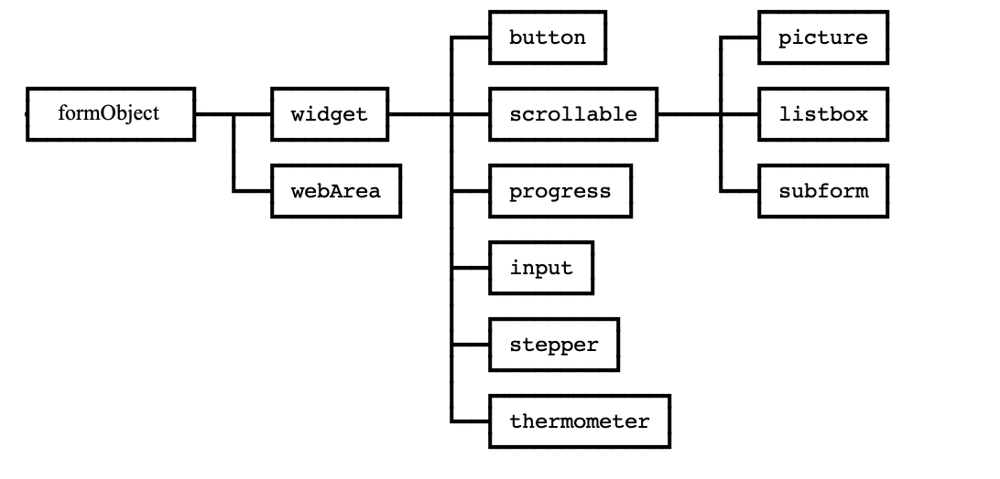

# formObject

The `formObject` class is the parent class of all form objects classes


> 📌 The `group` class can also refer to this class even if it's not inheritance
	
## Properties

|Properties|Description|Type||
|----------|-----------|:--:|-------|
|**.name** | The name of the form object| `Text`
|**.type** | The type of the form object| `Integer` | Use the [Form object Types](https://doc.4d.com/4Dv18R6/4D/18-R6/Form-Object-Types.302-5199153.en.html) constant theme
|**.coordinates** | The coordinates of the form object in the form| `Object` |{`left`,`top`,`right`,`bottom`}|
|**.dimensions** | The dimensions of the form object| `Object` |{`width`,`height`}|
|**.windowCoordinates** | The coordinates of the form object in the current window| `Object` |{`left`,`top`,`right`,`bottom`}|

## 🔸 cs.formObject.new()

The class constructor `cs.formObject.new({formObjectName})` creates a new class instance.

If the `formObjectName` parameter is ommited, the constructor use the result of **[OBJECT Get name](https://doc.4d.com/4Dv19/4D/19/OBJECT-Get-name.301-5392401.en.html)** (_Object current_ )
> 📌 Omitting the object name can only be used if the constructor is called from the object method.

## Summary

> 📌 All functions that return `cs.formObject` may include one call after another. 

| Function | Action |
| -------- | ------ |  
|.**show** ({state`:Boolean`}) →`cs.formObject` | To make the object visible (no parameter) or invisible (`state` = **False**) | 
|.**hide** () →`cs.formObject` | To hide the object |
|.**enable** ({state`:Boolean`}) →`cs.formObject` | To enable (no parameter) or disable (`state` = **False**) the object |
|.**disable** () →`cs.formObject` | To disable the object |
|.**setCoordinates** (left`:Integer `; top`:Integer`; {right`:Integer`; bottom`:Integer`}}) →`cs.formObject` | To modifies the coordinates and, optionally, the size of the object \* |
|.**setCoordinates** (coordinates`:Object`) →`cs.formObject` | "left", "top"{, "right", "bottom"}\*|
|.**getCoordinates** () →`Object` | Returns the updated coordinates object\* |
|.**bestSize** (alignement`:Integer`{ ; minWidth`:Integer`{ ; maxWidth`:Integer`}}) →`cs.formObject` | Set the size of the object to its best size according to its content (e.g. a localized string) \* |
|.**bestSize** ({options`:Object`}) →`cs.formObject` |{"alignement"}{, "minWidth"}{, "maxWidth"}\*  |
|.**moveHorizontally** (offset`:Integer`) →`cs.formObject` | To move the object horizontally \*  |
|.**moveVertically** (offset`:Integer`) →`cs.formObject` | To move the object vertically \*  |
|.**resizeHorizontally** (offset`:Integer`) →`cs.formObject` | To resize the object horizontally \*  |
|.**resizeVertically** (offset`:Integer`) →`cs.formObject` | To resize the object vertically \*  |
|.**moveAndResizeHorizontally** (offset`:Integer`;resize`:Integer`) →`cs.formObject` | To move and resize the object horizontally \*  |
|.**moveAndResizeVertically** (offset`:Integer`;resize`:Integer`) →`cs.formObject` | To move and resize the object vertically \*  |
|.**setDimension** (width`:Integer` ;{ height`:Integer`}) →`cs.formObject` | To modify the object width & height \*  |
|.**setHeight** (height`:Integer`) →`cs.formObject` | To modify the object height \*  |
|.**setWidth** (width`:Integer` ) →`cs.formObject` | To modify the object width \*  |
|.**setTitle** (title`:Text`) →`cs.formObject` | To change the title of the object (if the title is a `resname`, the localization is performed) \** |
|.**title** () →`Text` | Returns the title of the object \** |
|.**setFont** (fontName`:Text`}) →`cs.formObject` | To set the font|
|.**setFontStyle** ({style`:Integer`}) →`cs.formObject` | To set the style of the title (use the 4D constants _Bold_, _Italic_, _Plain_, _Underline_) Default = _Plain_ \** |
|.**setColors** (foreground{; background{; altBackground }}) →`cs.formObject` | To set the object color(s)  |
|.**getForegroundColor** () →`Text` | To get the foreground color of the object |
|.**isVisible** () →`Boolean` | Returns **True** if the object is visible and **False** otherwise |
|.**isHidden** () →`Boolean` | Returns **False** if the object is not visible and **False** otherwise |
|.**isEnabled** () →`Boolean` | Returns **True** if the object is enabled and **False** otherwise |
|.**updateCoordinates** (left`:Integer`; top`:Integer`; right`:Integer`; bottom`:Integer`)   →`cs.formObject` | To update `coordinates`, `dimensions` and `windowCoordinates` properties |
|.**addToGroup** (group : cs.group) →`cs.formObject` | Adds the current widget to a [**`group`**](group.md) |
    
\* Automatically update the `coordinates`, `dimensions` and `windowCoordinates` properties.    
\** Can be applied to a static text and will be avalaible for the inherited classes (buttons, check boxes, radio buttons, …)
