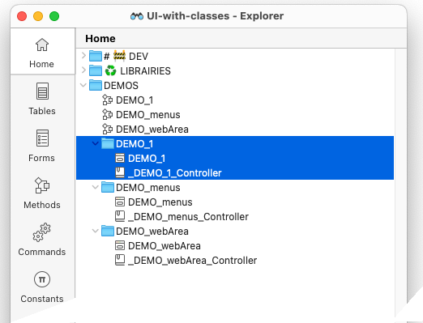
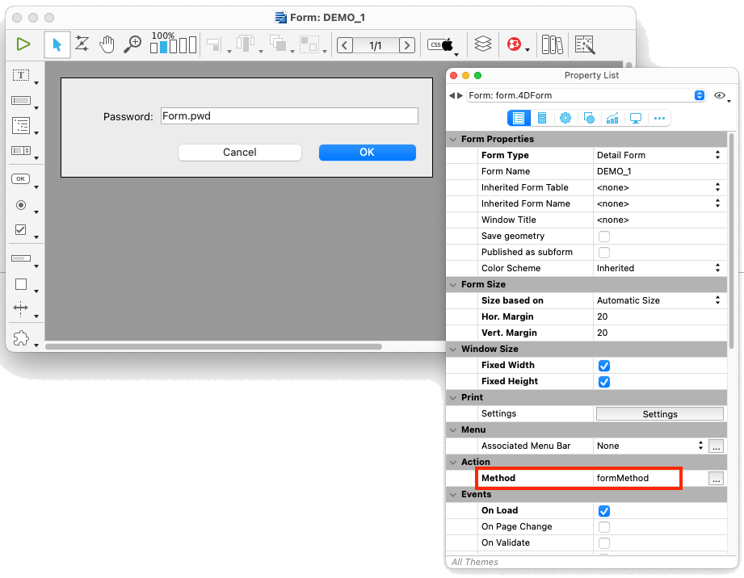

# Description

The purpose of the `formMethod` method is :

* If it hasn't already been done, initialize the form controller class, and store its instance in the `Form.__DIALOG__` property.

* Call the `handleEvents()` function of the controller class, passing it the form event object. 

# How do I use it?

Starting with the `DEMO_1` example

## 1️⃣ Create a dialog controller class.

For a `formName` form, create a class named `_<formName>_Controller`.
 


## 2️⃣ Use the method as the dialog's form method.

The `formMethod` method must be defined as the form method.



## 3️⃣ Instantiate the formDelegate class in the dialog controller class.

In the dialog controller class constructor, the property `.form` is set as `cs.formDelegate.new(This)`.    
See the [example](#sample) below.

## 4️⃣ Define the function handleEvents ( \$e ) In the dialog controller class.

The dialog class define, at least one function:  `.handleEvents()`    
See the [example](#sample) below.

## <a name="sample">Dialog controller class example</a>

```4d
// Class _myDialog_Controller
Class constructor
	
	This.isSubform:=False
	This.toBeInitialized:=False
	
	// Instantiate the formDelegate
	This.form:=cs.formDelegate.new(This) // 3️⃣ 
	
	This.form.init()
	
	// MARK:-[Standard Suite]
	// === === === === === === === === === === === === === === === === === === === === ===
Function init()
	
	/*
		Instantiate the widgets we want to manipulate.
		• Note that the label is not instantiated, as we don't need to act on it.
	*/
	
	This.pwd:=This.form.input.new("Input")
	
	// Bottom buttons
	This.ok:=This.form.button.new("Button")
	This.cancel:=This.form.button.new("Button1")
	
	// === === === === === === === === === === === === === === === === === === === === ===
Function handleEvents($e : cs.evt) // 4️⃣
	
	$e:=$e || cs.evt.new()
	
	If ($e.form)  // <== FORM METHOD
		
		Case of 
				
				//==============================================
			: ($e.load)
				
				This.form.onLoad()
				
				//==============================================
		End case 
		
	Else   // <== WIDGETS METHOD
		
		Case of 
				
				//==============================================
			: (This.ok.catch($e; [On Clicked]))
				
				// Make some validation then accept or not…
				If (This.pwd.isEmpty || (This.pwd.value="1234"))
					
					ALERT("Invalid pasword!")
					This.pwd.focus()
					return 
					
				End if 
				
				// All is OK, so we can validate
				ACCEPT
				
				//==============================================
			: (This.pwd.catch())
				
				This.ok.enable(This.pwd.isNotEmpty)
				
				//==============================================
		End case 
	End if 
	
	// === === === === === === === === === === === === === === === === === === === === ===
Function onLoad()
	
	// Create and install a minimal menu bar
	cs.menuBar.new().defaultMinimalMenuBar().set()
	
	// Set window title
	This.form.window.title:="Passkey"
	
	// Set the textbox as password & set a placeholder for it
	This.pwd.setPlaceholder("Please enter your password...")
	This.pwd.asPassword:=True
	
	// Distribute bottom buttons according to their label
	This.form.group.new(This.ok; This.cancel).distributeRigthToLeft()
	This.ok.helpTip:="Click here to validate your password"
	This.cancel.helpTip:="Click here to abandon"
	
	This.ok.disable()	
```
