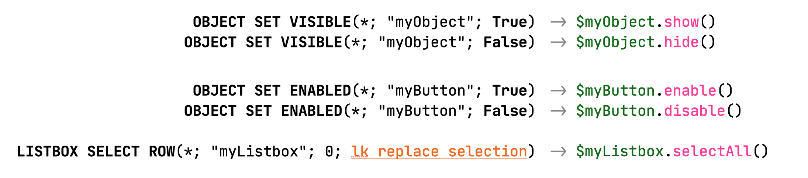

This repository is an evolution of the [classes](https://github.com/vdelachaux/classes) project and is essentially dedicated to the UI.

This is an attempt at syntax designed to work the way you write or read it.

_____

_____
Thanks to [4D](https://4d.com) for implementing the [classes](https://developer.4d.com/docs/19/en/Concepts/classes.html), this makes it possible to use class programming in 4D to make the code more readable and intuitive.

This is not a "how do I" nor a recommendation, but a work in progress way that may interest some developers to explore. If this is the case,  your contributions or comments will be welcome.

See the [Documentation](Documentation/Classes/) folder. I suggest you begin with the [`form` class documentation](Documentation/Classes/form.md) then with the [`formObject` class documentation](Documentation/Classes/formObject.md).

Notes that all the documentation is not yet available, but the demo forms should allow you to try.
	
> I strongly encourage you to enrich this project through pull request. This can only benefit the [4D developer community](https://discuss.4d.com). 
	
> `Enjoy the 4th dimension`

