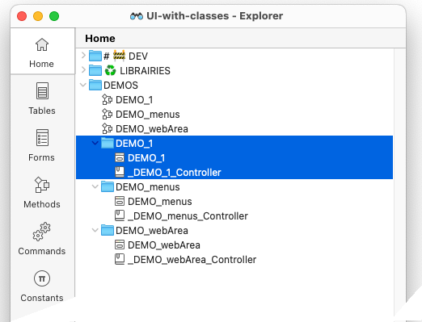

[](https://developer.4d.com/)
[](https://developer.4d.com/)

[](LICENSE)
[](https://github.com/vdelachaux/UI-with-Class/actions/workflows/build.yml)

## Welcome to this 4D repository dedicated to user interface classes* 

These classes are the result of my work over several years, taking advantage of evolutions in the [4D](https://4d.com) programming language. I've always sought to simplify the coding of the user interface of my developments and make it more naturally readable and easy to maintain. Another major motivation has been the need to be agile in making changes as a project evolves.

### Readability

Can you tell me how this line of code will modify the selection of listbox items?

```4d
LISTBOX SELECT ROW(*; "myListbox"; 0; lk replace selection)
```

I think not if there's no comment line to explain the action.

Wouldn't it be more readable to write:

```4d
myListbox.selectAll()
```
Other examples:

```4d
myComment.show()
myButton.enable()
myForm.window.title:="Passkey"
myButtonGroup.distributeRigthToLeft()
myInput.focus()
myForm.focusNext()

```

Or again:

```4d
$menu:=cs.menu.new()\
	.append("Language…"; cs.menu.new()\
	.append("English"; "en").setData("en"; "Hello world")\
	.append("Français"; "fr").setData("fr"; "Bonjour le monde")\
	.append("日本語"; "jp").setData("jp"; "ハロー・ワールド"))\
	.popup(myInput)
	
If ($menu.selected)
	myInput.value:=$menu.getData($menu.choice)
End if 	
```

So I can write or read the code and immediately know what's being done.

### Agility

I often have to modify the organization of the interface as projects evolve. For example, an input box needs to be moved from a form to a sub-form. When you copy the widget and paste it into the sub-form, it may change name, and you need to modify all the code that refers to this name i.e. all the **OBJECT** commands ... ( * ; "name" ; ... ) & others.

I define my widget once and for all with its name:

```4d
Form.myPassword:=myForm.input.new("Input")
```

This is the only line of code I might have to modify in the sub-form, after which the code no longer refers to this name:

```4d
Form.myPassword.setPlaceholder("Please enter your password...")
Form.myPassword.asPassword:=True

...

If (Form.myPassword.catch())
	
	Form.myButton.enable(Form.myPassword.isNotEmpty)
	
End if 
```
What's more, if a 4D command evolves, a simple update to a class function immediately benefits all objects in the project.

## Where to start

1. See the [How it works](#how) section below.
1. I suggest you first look at ***DEMO_1***, which is a simple case, to understand the design. Then you can run and explore the other demos that introduce more complicated or specific uses, I'm trying to show use cases like menu bar management or contextual menus.  Other demonstrations will follow (I need to enrich this part), as it's also instructive for optimizing and enriching commands. 
1. See the [Documentation](Documentation/Classes/) folder. I suggest you begin with the [`formDelegate` class documentation](Documentation/Classes/formDelegate.md).

> Please note that not all documentation is available/updated yet.    
> *As always, writing documentation is a time-consuming but instructive task, because in a number of cases it leads to changes, since what isn't simply described isn't a good implementation.*

## <a name="how">How does it work</a>

As you can see from the demos included in the project, each demo consists of a form and a class named `_<fornName>_Controller`. which I call the "`dialog class`". (The method with the same name as the form simply displays the dialog)



1️⃣ All forms use the method `formMethod` as the form method.    
>This method initializes the `dialog class`, if this is not the case, then calls its `handleEvents($e)` function, giving it the form's event object.    
>Also note that there are no object method


2️⃣ In the` dialog class` constructor, the property `.form` is set as `cs.formDelegate.new(This) `where **This** is the dialog class.

3️⃣ The` dialog class `define, at least one function:  `.handleEvents()`

```4d
// Class _myDialog_Controller
Class constructor
	
	This.isSubform:=False
	This.toBeInitialized:=False
	
	// Instantiate the formDelegate
	This.form:=cs.formDelegate.new(This)
	
	This.form.init()
	
	// MARK:-[Standard Suite]
	// === === === === === === === === === === === === === === === === === === === === ===
Function init()
	
	/*
		Instantiate the widgets we want to manipulate.
		• Note that the label is not instantiated, as we don't need to act on it.
	*/
	
	This.pwd:=This.form.input.new("Input")
	
	// Bottom buttons
	This.ok:=This.form.button.new("Button")
	This.cancel:=This.form.button.new("Button1")
	
	// === === === === === === === === === === === === === === === === === === === === ===
Function handleEvents($e : cs.evt)
	
	$e:=$e || cs.evt.new()
	
	If ($e.form)  // <== FORM METHOD
		
		Case of 
				
				//==============================================
			: ($e.load)
				
				This.form.onLoad()
				
				//==============================================
		End case 
		
	Else   // <== WIDGETS METHOD
		
		Case of 
				
				//==============================================
			: (This.ok.catch($e; [On Clicked]))
				
				// Make some validation then accept or not…
				If (This.pwd.isEmpty || (This.pwd.value="1234"))
					
					ALERT("Invalid pasword!")
					This.pwd.focus()
					return 
					
				End if 
				
				// All is OK, so we can validate
				ACCEPT
				
				//==============================================
			: (This.pwd.catch())
				
				This.ok.enable(This.pwd.isNotEmpty)
				
				//==============================================
		End case 
	End if 
	
	// === === === === === === === === === === === === === === === === === === === === ===
Function onLoad()
	
	// Create and install a minimal menu bar
	cs.menuBar.new().defaultMinimalMenuBar().set()
	
	// Set window title
	This.form.window.title:="Passkey"
	
	// Set the textbox as password & set a placeholder  for it
	This.pwd.setPlaceholder("Please enter your password...")
	This.pwd.asPassword:=True
	
	// Distribute bottom buttons according to their label
	This.form.group.new(This.ok; This.cancel).distributeRigthToLeft()
	This.ok.helpTip:="Click here to validate your password"
	This.cancel.helpTip:="Click here to abandon"
	
	This.ok.disable()	
```

## Collaborate

I strongly encourage you to [enrich this project through pull request](CONTRIBUTING.md). This can only benefit the [4D developer community](https://discuss.4d.com). 

> `Enjoy the 4th dimension`

----
\* An evolution of the [classes](https://github.com/vdelachaux/classes) project.


