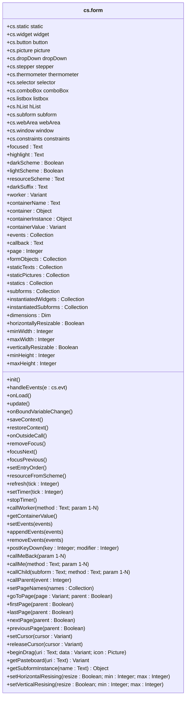

# form

The `form` class is intended to be called as a delegate by a `form controller class`, as in the code example below line 8.


### <a name="sample">Code sample for a `form controller class`</a>

```4d
// Class _myDialog_Controller
Class constructor
	
	This.isSubform:=False
	This.toBeInitialized:=False
	
	// Instantiate the form
	This.form:=cs.form.new(This)
	
	...
	
	This.form.init()
	
Function init()
	// Instantiate the widgets we want to manipulate.
	This.box:=This.form.input.new("Input")
	This.ok:=This.form.button.new("Button")
	This.cancel:=This.form.button.new("Button1")
	
	// Resize the window
	This.form.window.setDimensions(400; 600)

	// Set window title
	This.form.window.title:="Passkey"
	
	...
	
Function onLoad()
	
	...
	
	This.form.update()
	
Function handleEvents($e:cs.evt)
	
	...
	
Function update()
	
```

## Properties

|Properties|Description|Type|default|Writable|
|:----------|:-----------|:-----------:|:-----------|:-----------:|
|**.currentForm** | Current form name |`Text`|
|**.isSubform** | Is the form used as a subform * |`Boolean`|**False**|<font color="green">X</font>
|**.toBeInitialized** | Has the form been initialized *  |`Boolean`|**True**|<font color="green">X</font>
|**.window** | Current form window class object |`cs.window`
|**.constraints** | The constraints manager |`cs.constraints`

> *  To be set up by the `form controller class`

**Other properties are described below in the section devoted to them.**

## <a name="objects">Form objects instantiation functions</a>

In the `form controller class`, you instantiate the form objects you wish to manipulate (i.e. activate, deactivate, move, set a value, color, etc.) using the `<class>.new(<name>)` instantiation functions listed in the table below. See the [code sample](#sample) above, lines 16 to 18.

| Functions | |
|:-------- |:------ |  
|.**static**.*new* (name: `Text`) → `cs.static` | for a [static](static.md) element like a line, a rectangle…|
|.**widget**.*new* (name: `Text`) → `cs.widget` | for a [generic widget](widget.md) ie. not a static element|
|.**button**.*new* (name: `Text`) → `cs.button` | for a [button widget](button.md)|
|.**comboBox**.*new* (name: `Text`) → `cs.button` | for a [comboBox widget](comboBox.md)|
|.**dropDown**.*new* (name: `Text`) → `cs.dropDown` | for a [dropDown widget](dropDown.md)|
|.**group**.*new* (name: `Text`}) → `cs.group` | for a [group widget](group.md)|
|.**hList**.*new* (name: `Text`) → `cs.hList` | for a [hierarchical list widget](hList.md)|
|.**input**.*new* (name: `Text`) → `cs.input` | for an [input widget](input.md)|
|.**listbox**.*new* (name: `Text`) → `cs.listbox` | for a  [listbox widget](listbox.md)|
|.**picture**.*new* (name: `Text`) → `cs.picture` | for a  [picture widget](picture.md)|
|.**selector**.*new* (name: `Text`) → `cs.selector` | for a  [selector widget](selector.md)|
|.**stepper**.*new* (name: `Text`) → `cs.stepper` | for a  [stepper widget](stepper.md)|
|.**subform**.*new* (name: `Text`) → `cs.subform` | for a  [subform widget](subform.md)|
|.**thermometer**.*new* (name: `Text`) → `cs.thermometer` | for a  [thermometer widget](thermometer.md)|
|.**webArea**.*new* (name: `Text`) → `cs.webArea` | for a  [webArea widget](webArea.md)|

>📌 The `name` parameter is the name of the object used in the form definition.

Each instantiated form object inherits all the properties and functions of its class as you can see in each class documentation.

## Standard suite functions

The functions listed in the table below represent the standard suite. **They must be defined in the `form controller class` if you need them**, otherwise an alert will be raised. 

In the [code sample](#sample) above, line 12, the `This.form.init()` call explicitly describes that we want to initialize the form, but the initialization code is specific to the form and must therefore be in the class that drives it. This is the role of the `Function init()` function at line 14.

The `formMethod` method must be declared as the form method of all forms that are managed in this way. This method initializes the class associated with the dialog, which should be called `_<dialogName>_Controller`, and calls its `handleEvents()` function when a form event is generated. The `handleEvents`() function is therefore part of the standard suite and must be defined in the class associated with the dialog (line 34 of the [code sample](#sample) above).

| Functions | |
|:-------- |:------ |  
|.**init**() | to initialize the dialog|
|.**onLoad**() | to perform initializations when loading the form|
|.**handleEvents**() | to manage form events or form objects|
|.**update**() | to update the user interface|
|.**saveContext**() | to save the state of a form when it is unloaded, so that it can be restored when it is reloaded|
|.**restoreContext**() | to restore the context when the form is reloaded|
|.**onBoundVariableChange**() | for subforms|

The minimum suite (`init()`, `onLoad()`, `handleEvents()`) is presented in ***DEMO_1*** included in the project. The other demonstrations introduce the use of the suite's other functions.

## Navigation

|Properties|Description|Type|default|Writable|
|:----------|:-----------|:-----------|:-----------|:-----------:| 
|**.pageNumber** | Number of pages in the form |`Integer`
|**.page** | Current page number|`Integer`
|**.pages** | A hashmap table* for naming form pages |`Object`|{`Page_1`: 1, `Page_2`: 2, … , `Page_N`: N}|<font color="green">X</font>

>📌 The navigation functions apply by default to the current form. So if it's a sub-form, it's the sub-form's page that will be modified, unless you pass the optional `parent` parameter where allowed.

| Functions | Action |
|:-------- |:------ |  
|.**setPageNames** (names: `Collection`)| Defines the hashmap table* from the collection of names passed|
|.**goToPage** (page: `Integer`\| `Text` {; parent : `Boolean`})| Replaces the currently displayed form page with the form page specified by its page number or name.|
|.**firstPage** ({parent: `Boolean`})| Changes the currently displayed form page to the first form page|
|.**lastPage** ({parent: `Boolean`})| Changes the currently displayed form page to the last form page|
|.**nextPage** ({parent: `Boolean`})| Changes the currently displayed form page to the next form page|
|.**previousPage** ({parent: `Boolean`})| Changes the currently displayed form page to the previous form page|

\* The hashmap table allows navigation commands to access a page by its name instead of its page number.

## Timer

| Functions | Action |
|:-------- |:------ |  
|.**setTimer** ({tickCount: `Integer`}) | Starts a timer and sets its delay, ASAP if `tickCount ` is omitted|
|.**stopTimer** () | Disables the timer|
|.**refresh** () | Starts a timer to be executed as quickly as possible|

## Focus

|Properties|Description|Type|default|Writable|
|:----------|:-----------|:-----------|:-----------|:-----------:| 
|**.focused** | Name of the object that has the focus in the form |`Text`
|**.entryOrder** |  Entry order of the current form for the current process |  `Collection` | [ ]
|**.highlight** | Text currently selected, if applicable |`Text`

| Functions | Action |
|:-------- |:------ | 
|.**focus** (widget )| Gives the focus to a widget. `widget` can be a widget name or a widget object|
|.**removeFocus** ()| Removes any focus in the current form|
|.**focusNext** () | Go to next focusable widget |
|.**focusPrevious** () | Go to previous focusable widget |
|.**setEntryOrder** (names: `Collection`) | Sets the entry order of the current form for the current process |

## Events

|Properties|Description|Type|default|Writable|
|:----------|:-----------|:-----------|:-----------|:-----------:| 
|**.events** | Form event codes|`Collection`| Initialy populated according to the events activated for the form & the form objects

| Functions | Action |
|:-------- |:------ | 
|.**setEvents** (events: `Integer`\|`Collection`) | Define the event(s) for the current form|
|.**appendEvents** (events: `Integer`\|`Collection`) | Adds form event(s) for the current form|
|.**removeEvents** (events: `Integer`\|`Collection`) | Removes form event(s) for the current form|
|.**postKeyDown** (keyCode: `Integer` {; modifier: `Integer` }) |  Posts a keyboard event|

## Associated Worker

|Properties|Description|Type|default|Writable|
|:----------|:-----------|:-----------|:-----------|:-----------:| 
|**.worker** | Name or ID of the associated worker  |`Text`\|`Integer`|**Null**|<font color="green">X</font>

| Functions | Action |
|:-------- |:------ | 
|.**callWorker** (method: `Text`)<br/>.**callWorker** (method: `Text`;param: `Collection`)<br>.**callWorker** (method: `Text`;param;…; paramN) | Assigns a task to the associated worker|

## Calls

|Properties|Description|Type|default|Writable|
|:----------|:-----------|:-----------|:-----------|:-----------:| 
|**.callback** | Current callback method's name|`Text`|"formCallBack"|<font color="green">X</font>

| Functions | Action |
|:-------- |:------ | 
|.**callMeBack** ()<br/>.**callMeBack** (param: `Collection`)<br/>.**callMeBack** (param; … ; paramN) | Call the form using the current callback method|
|.**callMe** (method: `Text`)<br/>.**callMe** (method: `Text`; param: `Collection`)<br>.**callMe** (method: `Text`; param; … ; paramN) | Call the form with the passed method|
|.**callChild** (subform: `Object`\|`Text`; method: `Text`)<br/>.**callChild** (subform: `Object`\|`Text`; method: `Text`; param: `Collection`)<br>.**callChild** (subform: `Object`\|`Text`; method: `Text`; param; … ; paramN) | Executes a project method in the context of a subform<br>(without returned value)|

## Dimensions & resizing

|Properties|Description|Type|default|Writable|
|:----------|:-----------|:-----------|:-----------|:-----------:| 
|.**dimensions** |`Object`| Form dimensions as an object {`width`,`height`}|
|**.horizontallyResizable** | **True** if the form can be resized horizontally |`Boolean`||<font color="green">X</font>
|**.minWidth** |  |`Integer`||<font color="green">X</font>
|**.maxWidth** |  |`Integer`||<font color="green">X</font>
|**.verticallyResizable** | **True** if the form can be resized vertically  |`Boolean`||<font color="green">X</font>
|**.minHeight** |  |`Integer`||<font color="green">X</font>
|**.maxHeight** |  |`Integer`||<font color="green">X</font>


| Functions | Action |
|:-------- |:------ | 
|.**setHorizontalResising** (resizable: `Boolean` {; min: `Integer` {; max: `Integer`}})| Change the form horizontal resizing properties|
|.**setVerticalResising** (resizable: `Boolean` {; min: `Integer` {; max: `Integer`}})| Change the form  vertical resizing properties|

## Color scheme

|Properties|Description|Type|default|Writable|
|:----------|:-----------|:-----------|:-----------|:-----------:| 
|**.darkScheme** | **True** if the current color scheme is dark |`Boolean`
|**.lightScheme** | **True** if the current color scheme is light |`Boolean`
|**.darkSuffix** | Suffix used to select the appropriate resource according to the color scheme |`Text`|"_dark"|<font color="green">X</font>

| Functions | Action |
|:-------- |:------ |  
|.**resourceFromScheme** (path: `Text`) → `Text` | Returns the access path to the given resource path with the dark suffix, if applicable |

## Subforms

|Properties\*|Description|Type|default|Writable|
|:----------|:-----------|:-----------|:-----------|:-----------:| 
|**.container** | The container class object|`Object`
|**.containerName** | The name of the container |`Text`
|**.containerValue** | Value of the container |`Variant`||<font color="green">X</font>
|**.containerInstance** | The container instance|`Object`

> \*  Reading these properties when `isSubform` = **False**, generates an error.

| Functions* | Action |
|:-------- |:------ | 
|.**setContainerValue** (value: `Variant`) | Sets the container value|
|.**getContainerValue** () → `Variant` | Returns the container value|
|.**callParent** (eventCode: `Integer`) | Sends an event to the subform container|

> \*  Calling these functions when `isSubform` = **False**, generates an error.
 
## Drag & Drop

| Functions | Action |
|:-------- |:------ |  
|.**beginDrag** (uri: `Text`; data: `Variant` {; icon: `Picture`})| Appends `data` to the pasteboard under the data type specified in `uri`.<br>Also sets the drag icon if passed|
|.**getPasteboard** (uri: `Text`) → `Variant`| Returns the `data` from the pasteboard and whose type you pass in `uri`|

## Cursor

| Functions | Action |
|:-------- |:------ | 
|.**setCursor** (cursor: `Integer`\|`Text`)| Sets the mouse cursor to the <a href="https://github.com/vdelachaux/tip-and-tricks/blob/master/docs/Don't%20forget%20the%20cursor.md">cursor type</a> specified in `cursor` by its number or name.|
|.**releaseCursor** ()| Restores the standard mouse cursor| 

## Form definition access

|Properties|Description|Type|
|:----------|:-----------|:-----------|
|**.formObjects** | All form objects names | `Collection` 
|**.staticTexts** | All static text names | `Collection` 
|**.staticPictures** | All static pictures names | `Collection` 
|**.statics** | All static form object names (Texts & Pictures) | `Collection` 
|**.subforms** | All subform form object names | `Collection` 
|**.instantiatedWidgets** | All instantiated widgets objects | `Collection` 
|**.instantiatedSubforms** | All instantiated subforms objects | `Collection`

## Class diagram


	
