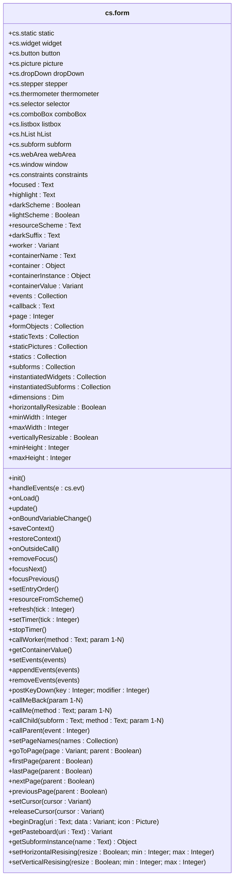

# form

The `form` class is intended to be called as a delegate by a `form controller class`, as in the code example below line 8.

> 📌 **Note**: to simplify the distinction between form objects and object type, this documentation uses the term “widget” for all form objects, whether static (a line, a rectangle…) or not (a button, a subform…). 


## <a name="Constructor"> Constructor </a>

### <a name="sample">Code sample for a `form controller class`</a>

```4d
// Class _myDialog_Controller
Class constructor
	
	This.isSubform:=False
	This.toBeInitialized:=False
	
	// Instantiate the form
	This.form:=cs.form.new(This)
		
	...
	
	This.form.init()
	
Function init()
	// Instantiate the widgets we want to manipulate.
	This.box:=This.form.Input("Input")
	This.ok:=This.form.Button("Button")
	This.cancel:=This.form.Button("Button1")
	
	// Resize the window
	This.form.window.setDimensions(400; 600)

	// Set window title
	This.form.window.title:="Passkey"
	
	...
	
Function onLoad()
	
	...
	
	This.form.update()
	
Function handleEvents($e:cs.evt)
	
	...
	
Function update()
	
```
<hr>
> ⚠️ If you're using UI classes from a component, since the component doesn't have access to the host database's form definition, you need to call the delegate instantiation (line 8) like this:

```4d
This.form:=cs.form.new(This; Try(JSON Parse(File("/SOURCES/Forms/"+Current form name+"/form.4DForm").getText())))
```
## Table of Contents

* [Properties](#Properties)
* [Form objects instantiation functions](#objects)
* [Standard suite functions](#suite)
* [Navigation](#navigation)
* [Timer](#Timer)
* [Focus](#Focus)
* [Events](#Events)
* [Associated Worker](#Worker)
* [Calls](#Calls)
* [Dimensions & resizing](#Dimensions)
* [Color scheme](#scheme)
* [Subforms](#Subforms)
* [Drag & Drop](#Drag)
* [Cursor](#Cursor)
* [Miscellaneous](#Miscellaneous)
* [Form definition access](#access)

## <a name="Properties">General Properties</a>

> 📌 Other properties are described below in the section devoted to them.

|Properties|Description|Type|default|Writable|
|:----------|:-----------|:-----------:|:-----------|:-----------:|
|**.name** | Current form name |`Text`||<font color="red">x</font>
|**.isSubform** | Is the form used as a subform * |`Boolean`|**False**|<font color="green">✓</font>
|**.toBeInitialized** | Has the form been initialized *  |`Boolean`|**True**|<font color="green">✓</font>
|**.window** | Current form window class object |`cs.window`||<font color="red">x</font>
|**.constraints** | The constraints manager |`cs.constraints`||<font color="red">x</font>

> *  To be set up by the `form controller class`    


## <a name="objects">Form widget instantiation functions</a>

In the `form controller class`, you instantiate the widgets (form objects) you wish to manipulate (i.e. activate, deactivate, move, set a value, color, etc.) using the `form.<Type>(<name>)` instantiation functions listed in the table below. See the [code sample](#sample) above, lines 16 to 18.

> 🚨 Please note that **the names of these functions start with a capital letter**. For backward compatibility reasons, the same functions, without capital, letters are still defined, but should no longer be used, as they may be deleted in the future. If you are concerned, please take time to replace the lines like: <br>
>                `This.form.<type>.new(“name”)` <br>
>by <br>
>                `This.form.<Type>(“name”)`.

| Functions | |
|:-------- |:------ |  
|.**Button** (name: `Text`) → [**cs**.button](button.md) | for a [Button](https://developer.4d.com/docs/FormObjects/buttonOverview), a [Check Box](https://developer.4d.com/docs/FormObjects/checkboxOverview) or a [Radio Button](https://developer.4d.com/docs/FormObjects/radiobuttonOverview)|
|.**ComboBox** (name: `Text` {; data : `Object`}) → **cs**.comboBox | for a [Combo Box](https://developer.4d.com/docs/FormObjects/comboBoxOverview)|
|.**DropDown** (name: `Text` {; data : `Object`}) → **cs**.dropDown | for a [Drop-down List](https://developer.4d.com/docs/FormObjects/dropdownListOverview)|
|.**HList** (name: `Text` {; ref : `Integer`}) → **cs**.hList | for a [Hierarchical List](https://developer.4d.com/docs/FormObjects/listOverview)|
|.**Input** (name: `Text`) → [**cs**.input](input.md) | for an [Input](https://developer.4d.com/docs/FormObjects/inputOverview)|
|.**Listbox** (name: `Text`) → [**cs**.listbox](listbox.md) | for a  [List Box](https://developer.4d.com/docs/FormObjects/listboxOverview)|
|.**Picture** (name: `Text`) → **cs**.picture | for a  [Static Picture](https://developer.4d.com/docs/FormObjects/staticPicture)|
|.**Static** (name: `Text`) → [**cs**.static](static.md) | for a [Shapes](https://developer.4d.com/docs/FormObjects/shapesOverview) or static widgets like [Group Box](https://developer.4d.com/docs/FormObjects/groupBox)|
|.**Stepper** (name: `Text`) → **cs**.stepper | for a  [Stepper](https://developer.4d.com/docs/FormObjects/stepper)|
|.**Subform** (name: `Text`) → **cs**.subform | for a  [Subform](https://developer.4d.com/docs/FormObjects/subformOverview)|
|.**TabControl** (name: `Text` {; data : `Object`}) → **cs**.tabControl | for a  [Tab Control](https://developer.4d.com/docs/FormObjects/tabControl)|
|.**thermometer**.*new* (name: `Text`) → [**cs**.thermometer](thermometer.md) | for a [Progress Indicator](https://developer.4d.com/docs/FormObjects/progressIndicator) |
|.**webArea**.*new* (name: `Text`) → **cs**.webArea | for a  [Web Area](https://developer.4d.com/docs/FormObjects/webAreaOverview) |

In addition, other handler can be instantiated. For example: a `Group` allows you to manage several widgets at once, since groups created in design mode cannot be manipulated at runtime. 

| Functions | |
|:-------- |:------ |  
|.**Group** ({name: `Text`}) → [**cs**.group](group.md) | to manage several widgets at once|
|.**Selector** (name: `Text`) → **cs**.selector | a superclass to manage Dropdown, Combo Box and Tab Control widgets|
|.**Scrollable** (name: `Text`) → [**cs**.scrollable](scrollable.md) | a superclass to manage widgets that accept scrollbars|
|.**Widget**.*new* (name: `Text`) → [**cs**.widget](widget.md) | a superclass to manage all active form widgets|

>📌 The `name` parameter is the object name as defined in the form editor.

Each instantiated form object inherits all the properties and functions of its class as you can see in each class documentation.

##  <a name="suite">Standard suite functions</a>

>📌 The functions listed in the table below represent the standard suite. **They must be defined in the `form controller class` if you need them**, otherwise an alert will be raised if you call one without having defined it.

In the [code sample](#sample) above, line 12, the `This.form.init()` call explicitly describes that we want to initialize the form, but the initialization code is specific to the form and must therefore be in the class that drives it. This is the role of the `Function init()` function at line 14.

The `formMethod` method must be declared as the form method of all forms that are managed in this way. This method initializes the class associated with the dialog, which should be called `_<dialogName>_Controller`, and calls its `handleEvents()` function when a form event is generated. The `handleEvents`() function is therefore part of the standard suite and must be defined in the class associated with the dialog (line 34 of the [code sample](#sample) above).

| Functions | |
|:-------- |:------ |  
|.**init**() | to initialize the dialog|
|.**handleEvents**() | to manage form events or form objects|
|.**onLoad**() | to perform initializations when loading the form|
|.**update**() | to update the user interface|
|.**onOutsideCall**() | to manage a call performed with [POST OUTSIDE CALL](https://developer.4d.com/docs/commands/post-outside-call)|
|.**saveContext**() | to save the state of a form when it is unloaded, so that it can be restored when it is reloaded|
|.**restoreContext**() | to restore the context when the form is reloaded|
|.**onBoundVariableChange**() | for subforms|

The minimum suite (`init()`, `onLoad()`, `handleEvents()`) is presented in ***[DEMO_1](../../../test UI/Project/Sources/Classes/_DEMO_Menus_Controller.4dm)*** into the test UI project of the repository. The other demonstrations introduce the use of the suite's other functions.

## <a name="navigation">Navigation</a>

|Properties|Description|Type|default|Writable|
|:----------|:-----------|:-----------|:-----------|:-----------:| 
|**.pageNumber** | Number of pages in the form |`Integer`||<font color="red">x</font>
|**.page** | Current page number|`Integer`||<font color="red">x</font>
|**.pages** | A hashmap table* for naming form pages |`Object`|{`Page_1`: 1, `Page_2`: 2, … , `Page_N`: N}|<font color="green">✓</font>

>📌 The navigation functions apply by default to the current form. So if it's a sub-form, it's the sub-form's page that will be modified, unless you pass the optional `parent` parameter where allowed.

| Functions | Action |
|:-------- |:------ |  
|.**setPageNames** (names: `Collection`)| Defines the hashmap table* from the collection of names passed|
|.**pageFromName** (name: `Text`) : `Integer`| Returns a page number from its name|
|.**goToPage** (page: `Integer`\| `Text` {; parent : `Boolean`})| Replaces the currently displayed form page with the form page specified by its page number or name.|
|.**firstPage** ({parent: `Boolean`})| Changes the currently displayed form page to the first form page|
|.**lastPage** ({parent: `Boolean`})| Changes the currently displayed form page to the last form page|
|.**nextPage** ({parent: `Boolean`})| Changes the currently displayed form page to the next form page|
|.**previousPage** ({parent: `Boolean`})| Changes the currently displayed form page to the previous form page|

\* The hashmap table allows navigation commands to access a page by its name instead of its page number.

## <a name="Timer">Timer</a>

|Properties|Description|Type|default|Writable|
|:----------|:-----------|:-----------:|:-----------|:-----------:|
|**.deferedTimer** | The last registered deffered action ID |`Integer`||<font color="green">✓</font>

| Functions | Action |
|:-------- |:------ |  
|.**setTimer** ({tickCount: `Integer`}) | Starts a timer and sets its delay, ASAP if `tickCount ` is omitted|
|.**stopTimer** () | Disables the timer|
|.**refresh** () | Starts a timer to be executed as quickly as possible|
|.**deferTimer** (id : `Integer`; tickCount : `Integer`) | Registers the ID of an action to be executed in the next timer cycle <br>& launch timer ASAP or after `tickCount` parameter|
|.**clearDeferedTimer** () | Remove all registered deffered actions and stop the timer|

## <a name="Focus">Focus</a>

|Properties|Description|Type|default|Writable|
|:----------|:-----------|:-----------|:-----------|:-----------:| 
|**.focused** | Name of the object that has the focus in the form |`Text`||<font color="red">x</font>
|**.entryOrder** |  Entry order of the current form for the current process |  `Collection` | [ ]|<font color="red">x</font>
|**.highlight** | Text currently selected, if applicable |`Text`||<font color="red">x</font>

| Functions | Action |
|:-------- |:------ | 
|.**focus** (widget )| Gives the focus to a widget. `widget` can be a widget name or a widget object|
|.**removeFocus** ()| Removes any focus in the current form|
|.**focusNext** () | Go to next focusable widget |
|.**focusPrevious** () | Go to previous focusable widget |
|.**setEntryOrder** (names: `Collection`) | Sets the entry order of the current form for the current process |

## <a name="Events">Events</a>

|Properties|Description|Type|default|Writable|
|:----------|:-----------|:-----------|:-----------|:-----------:| 
|**.events** | Form event codes|`Collection`| Initialy populated according to the events activated for the form & the form objects|<font color="red">x</font>

| Functions | Action |
|:-------- |:------ | 
|.**setEvents** (events: `Integer`\|`Collection`) | Define the event(s) for the current form|
|.**appendEvents** (events: `Integer`\|`Collection`) | Adds form event(s) for the current form|
|.**removeEvents** (events: `Integer`\|`Collection`) | Removes form event(s) for the current form|
|.**postKeyDown** (keyCode: `Integer` {; modifier: `Integer` }) |  Posts a keyboard event|

## <a name="Worker">Associated Worker</a>

|Properties|Description|Type|default|Writable|
|:----------|:-----------|:-----------|:-----------|:-----------:| 
|**.worker** | Name or ID of the associated worker  |`Text`\|`Integer`|**Null**|<font color="green">✓</font>

| Functions | Action |
|:-------- |:------ | 
|.**callWorker** (method: `Text`)<br/>.**callWorker** (method: `Text`;param: `Collection`)<br>.**callWorker** (method: `Text`;param;…; paramN) | Assigns a task to the associated worker|

## <a name="Calls">Calls</a>

|Properties|Description|Type|default|Writable|
|:----------|:-----------|:-----------|:-----------|:-----------:| 
|**.callback** | Current callback method's name|`Text`|"formCallBack"|<font color="green">✓</font>

| Functions | Action |
|:-------- |:------ | 
|.**callMeBack** ()<br/>.**callMeBack** (param: `Collection`)<br/>.**callMeBack** (param; … ; paramN) | Call the form using the current callback method|
|.**callMe** (method: `Text`)<br/>.**callMe** (method: `Text`; param: `Collection`)<br>.**callMe** (method: `Text`; param; … ; paramN) | Call the form with the passed method|
|.**callChild** (subform: `Object`\|`Text`; method: `Text`)<br/>.**callChild** (subform: `Object`\|`Text`; method: `Text`; param: `Collection`)<br>.**callChild** (subform: `Object`\|`Text`; method: `Text`; param; … ; paramN) | Executes a project method in the context of a subform<br>(without returned value)|
|.**spreadToChilds** (message : `Object`{; subforms : `Collection`})| Execute the message.method into all the subforms of the current forms
|.**callParent** (eventCode: `Integer`) | Sends an event to the subform container|

## <a name="Dimensions">Dimensions & resizing</a>

|Properties|Description|Type|default|Writable|
|:----------|:-----------|:-----------|:-----------|:-----------:| 
|.**dimensions**| Form dimensions as an object {`width`,`height`} |`Object`||<font color="red">x</font>
|**.horizontallyResizable** | Can the form be resized horizontally |`Boolean`||<font color="green">✓</font>
|**.minWidth** | The smallest form width allowed (pixels) |`Integer`||<font color="green">✓</font>
|**.maxWidth** | The largest form width allowed (pixels) |`Integer`||<font color="green">✓</font>
|**.verticallyResizable** | Can the form be resized vertically  |`Boolean`||<font color="green">✓</font>
|**.minHeight** | The smallest form height allowed (pixels) |`Integer`||<font color="green">✓</font>
|**.maxHeight** | The largest form height allowed (pixels) |`Integer`||<font color="green">✓</font>


| Functions | Action |
|:-------- |:------ | 
|.**setHorizontalResising** (resizable: `Boolean` {; min: `Integer` {; max: `Integer`}})| Change the form horizontal resizing properties|
|.**setVerticalResising** (resizable: `Boolean` {; min: `Integer` {; max: `Integer`}})| Change the form  vertical resizing properties|

## <a name="scheme">Color scheme</a>

|Properties|Description|Type|default|Writable|
|:----------|:-----------|:-----------|:-----------|:-----------:| 
|**.colorScheme** | Name of the last updated color scheme |`Text`||<font color="red">x</font>
|**.darkScheme** | Is the current color scheme “dark” |`Boolean`||<font color="red">x</font>
|**.lightScheme** | Is the current color scheme “light" |`Boolean`||<font color="red">x</font>
|**.resourceScheme** | Returns the current scheme suffix |`Boolean`||<font color="red">x</font>
|**.darkSuffix** | Suffix used to select the appropriate resource according to the color scheme |`Text`|"_dark"|<font color="green">✓</font>

| Functions | Action |
|:-------- |:------ |  
|.**resourceFromScheme** (path: `Text`) → `Text` | Returns the access path to the given resource path with the dark suffix, if applicable |

## <a name="Subforms">Subforms</a>

|Properties\*|Description|Type|default|Writable|
|:----------|:-----------|:-----------|:-----------|:-----------:| 
|**.container** | The container class object|`Object`||<font color="red">x</font>
|**.containerName** | The name of the container |`Text`||<font color="red">x</font>
|**.containerValue** | Value of the container |`Variant`||<font color="green">✓</font>
|**.containerInstance** | The container instance|`Object`||<font color="red">x</font>

> \*  Reading these properties when `isSubform` = **False**, generates an error.

| Functions* | Action |
|:-------- |:------ | 
|.**setContainerValue** (value: `Variant`) | Sets the container value|
|.**getContainerValue** () → `Variant` | Returns the container value|
|.**callParent** (eventCode: `Integer`) | Sends an event to the subform container|

> \*  Calling these functions when `isSubform` = **False**, generates an error.
 
## <a name="Drag">Drag & Drop</a>

| Functions | Action |
|:-------- |:------ |  
|.**beginDrag** (uri: `Text`; data: `Variant` {; icon: `Picture`})| Appends `data` to the pasteboard under the data type specified in `uri`.<br>Also sets the drag icon if passed|
|.**getPasteboard** (uri: `Text`) → `Variant`| Returns the `data` from the pasteboard whose type you pass in `uri`|

## <a name="Cursor">Cursor</a>

| Functions | Action |
|:-------- |:------ | 
|.**setCursor** (cursor: `Integer`\|`Text`)| Sets the mouse cursor to the <a href="https://github.com/vdelachaux/tip-and-tricks/blob/master/docs/Don't%20forget%20the%20cursor.md">cursor type</a> specified in `cursor` by its number or name.|
|.**releaseCursor** ()| Restores the standard mouse cursor| 

## <a name="Miscellaneous">Miscellaneous</a>

| Functions | Action |
|:-------- |:------ | 
| .**getScreenshot** ({page:`Integer`}) : `Picture`| Returns the form as a picture. See [FORM SCREENSHOT](https://developer.4d.com/docs/commands/form-screenshot)

## <a name="access">Form definition access</a>

|Properties|Description|Type|Writable|
|:----------|:-----------|:-----------|:-----------:| 
|**.formObjects** | All form objects names | `Collection` |<font color="red">x</font>
|**.staticTexts** | All static text names | `Collection` |<font color="red">x</font>
|**.staticPictures** | All static pictures names | `Collection` |<font color="red">x</font>
|**.statics** | All static form object names (Texts & Pictures) | `Collection` |<font color="red">x</font>
|**.subforms** | All subform form object names | `Collection` |<font color="red">x</font>
|**.instantiatedWidgets** | All instantiated widgets objects | `Collection` |<font color="red">x</font>
|**.instantiatedSubforms** | All instantiated subforms objects | `Collection`|<font color="red">x</font>

## Class diagram


	
