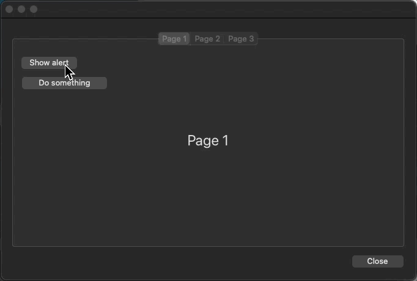

# onBoard

`onBoard` is a class that lets you incorporate sub-forms as dialogs in a form, even in a multi-page form.

Thanks to this class, the unglamorous work is taken care of:

* load the sub-form on the fly, creating one instance per page.
* control it from a worker
* reposition it if the main form is resized.

You can concentrate on your dialogues without worrying about the mechanics.

##  



## A few tips for getting started

You can see how this works in the HDI form included in the project.

I would just like to draw your attention to a few important points:

* The sub-form area is located on `page 0` of the main form, its expression type is `object` and it is configured to grow both horizontally and vertically. Its name is important, as we'll be using it to declare the intances of the built-in subforms.
* You need to modify the method of this object if you want to manage specific actions. An example is given. This is where you can retrieve the contents of the sub-form's Form object
* Embedded dialogs are declared in the `On load` event of the main form by creating an instance of the onBoard class. For example:
    
    ```4d
    Form.alert:=cs.onBoard.new("on-board"; "MESSAGE")
    Form.alert.me:=Form.alert
    ```
    
    * The first parameter of the constructor is the name of the sub-form object container you created earlier, the second is the name of the form to be used.
    * After that, set the `me` attribute to itself to enable the class functions to be used in the sub-form.

The instance can manage its positioning when the main form is resized. To do this, one of the objects in your sub-form must be called `main` and configured to move horizontally and vertically (usually a background). The `onResize()` function tracks the coordinates of the `main` object and moves all other objects in the sub-form accordingly. To take advantage of this, simply call the function in the `On resize` event of the sub-form as follows:

```4d
If (FORM Event.code=On Resize)
	
	Form.me.onResize()
	
End if
```
In the same way, you can call function `onLoad()` to initialize the content of static texts named `title` and `additional` and the title of buttons named `cancel` & `ok`.

```4d
If (FORM Event.code=On Load)
	
	Form.me.onLoad()
	
End if
```
Other functions can be used in the sub-form:

```4d
Form.me.close()
Form.me.accept()
Form.me.cancel()
```

or from a worker:

```4d
CALL FORM($caller; Formula(Form.progress.setProgress($progress; $message)))
```
