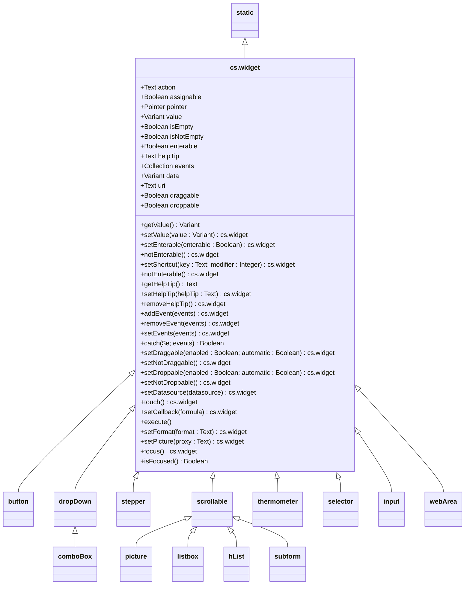

# widget

The `widget ` class provides an interface to manage properties and actions of active widget.

<hr>
📌 <b>Important</b>

1. This class inherit from the [`static`](static.md) class
2. This class is a transition class between the `static` class and more specific classes like `input`, `button`, `listbox`…
3. _Normally, you'll never have to instantiate the **cs**.widget class_, since instantiation is automatic with a more specialized widget.
4. To simplify the distinction between form objects and object type, this documentation uses the term `widget` for all form objects, whether static (a line, a rectangle…) or not (a button, a subform…).
5. All functions that return `This` return the current widget object and can include one call after another. 

<hr>

The `widget` class is available via the [`form`](form.md#objects) class through the `Widget` interface.

```4d
This.form:=cs.form.new(This)
...
This.myWidget:=This.form.Widget("myWidget")
...
This.myWidget.droppable:=True
```

This class is, more generally, available from the `cs` class store, or `cs.ui` class store if you use the `UI` component.

```4d
Form.myWidget:=cs.ui.widget.new("form object")
Form.myWidget.setDroppable(True; False)
```

# Summary

## <a name="Inherited">Inherited Properties & Functions</a>

See the [parent class](static.md)

## <a name="Properties">Properties & Functions</a>

* [Value](#Value)
* [Data Source](#Data)
* [Entry](#Entry)
* [Events](#Events)
* [Callback](#Callback)
* [User Data](#Data)
* [Drag & drop](#DragAndDrop)
* [Actions](#Actions)
* [Miscellaneous](#Miscellaneous)

<hr>

### <a name="Value">Value</a>

|Properties|Description|Type|Writable|
|:----------|:-----------|:-----------|:-----------:| 
|.**isEmpty** | Returns **True** if the widget value is empty \* | `Boolean` |<font color="red">x</font>
|.**isNotEmpty** | Returns **True** if the widget value is not empty \* | `Boolean` |<font color="red">x</font>
|.**value** | The value associated to the widget \**  | `Variant` |<font color="green">✓</font>

\* Empty values are : Null, 0, !00-00-00 !, ?00:00:00 ?, {}, [], False, an empty string or an empty image.

| Functions | |
|:-------- |:------ | 
|.**clear** () →`This` | Sets empty value\* to the datasource according to its type
|.**getValue** ( ) →`This` | Returns the value associated to the widget \** 
|.**setValue** ( *value* ) →`This` | Sets the value of the widget

\** For a text input box that has the focus, returns text as it is being entered.

### <a name="Data">Data Source</a>

|Properties|Description|Type|default|Writable|
|:----------|:-----------|:-----------|:-----------|:-----------:| 
|.**datasource** | Sets the data source for the widget | `4D.Formula` \| `Text Formula` | | <font color="green">✓</font>

| Functions | |
|:-------- |:------ |  
|.**setDatasource** ( *datasource* :`4D.Function`) →`This` | Sets the data source for the widget

### <a name="Entry">Entry</a>

|Properties|Description|Type|Writable|
|:----------|:-----------|:-----------|:-----------:| 
|.**contextMenu** | Context menu associated with the widget or not | `Boolean` |<font color="green">✓</font>
|.**enterable** | Makes the widget enterable or not | `Boolean` |<font color="green">✓</font>
|.**helpTip** | Associated help message | `Text` |<font color="green">✓</font>

| Functions | |
|:-------- |:------ | 
|.**getHelpTip** () →`Text` | Returns the associated help tip
|.**getShortcut** () →`Object` | Returns the associated shortcut definition <br>`{key (Text), modifier (Integer)}`
|.**notEnterable** () →`This` | Makes the widget non-enterable
|.**removeHelpTip** () →`This` | Removes the associated helptip
|.**setEnterable** ( {*enterable*} ) →`This` | Makes the widget enterable according to enterable parameter<br> Default is **True**
|.**setHelpTip** ( *tip* ) →`This` | Sets the associated help tip. <br>If `tip` is ommitted, the help tip will be removed.
|.**setShortcut** ( *key* {; *modifier* }) →`This` | Sets the associated shortcut

## <a name="Events">Events</a>

|Properties|Description|Type|Writable|
|:----------|:-----------|:-----------|:-----------:| 
|.**events** | The widget's form events (codes) | `Collection` | <font color="green">✓</font>

| Functions | |
|:-------- |:------ | 
|.**addEvent** ( *code* \| *codeCollection* ) →`This` | Appends one or more event codes to the widget
|.**catch** ( {*event* {; *code* \| *codeCollection* }}) →`Boolean`| Returns **True** if the widget is causing the form event & executes the [callback](#Callback) formula if it exists.<br/>Pass an event code or collection of event codes to restrict the response to these events.
|.**removeEvent** ( *code* \| *codeCollection*  ) →`This` | Removes one or more event codes to the widget
|.**setEvents** ( *code* \| *codeCollection* ) →`This` | Sets one or more event codes to the widget

## <a name="Callback">Callback</a>

| Functions | |
|:-------- |:------ | 
|.**setCallback** ( *formula* \| "This.\<function>"}) →`This` | Associates a callback to be executed when a form event occurs
|.**execute** () | Executes the callback associated with the widget if it exists

## <a name="Data">User Data</a>

> 📌 User data can be anything you want to attach to the widget and retrieve later..

|Properties|Description|Type|Writable|
|:----------|:-----------|:-----------|:-----------:| 
|.**data** | Any user data you want attach to the widget | `Variant`| <font color="green">✓</font>

| Functions | |
|:-------- |:------ | 
|.**setData** ( *object* ) →`This` | Set or enrich the `data` property with the contents of an object<br>If the `data` property is not **Null** or is not an `Object`, an error is raised.

## <a name="DragAndDrop">Drag & drop</a>

|Properties|Description|Type|Writable|
|:----------|:-----------|:-----------|:-----------:| 
|.**uri** | The Uniform Resource Identifier (URI) associated with the widget | `Text`|  <font color="green">✓</font>

## <a name="Actions">Actions</a>

|Properties|Description|Type|Writable|
|:----------|:-----------|:-----------|:-----------:| 
|.**action** | Name and (if any) parameter of the [Standard action](https://developer.4d.com/docs/FormObjects/propertiesAction#standard-action) associated with the widget | `Text` |<font color="green">✓</font>
|.**draggable** | The dragging option | `Boolean`|<font color="green">✓</font>
|.**droppable** | The drop-off option | `Boolean`|<font color="green">✓</font>

| Functions | |
|:-------- |:------ | 
|.**setDraggable** ( *enable* {; *automaticDrag*}) →`This` | Sets the drag options
|.**setDroppable** ( *enable* {; *automaticDrop*}) →`This` | Sets the drop options<br/> Default: accept drop and not automatic
|.**setNotDraggable** () →`This` | Disables drag option
|.**setNotDroppable** () →`This` | Disables the droppable option

## <a name="Miscellaneous">Miscellaneous</a>

|Properties|Description|Type|Writable|
|:----------|:-----------|:-----------|:-----------:| 
|.**pointer** | Returns the pointer to the widget<br>⚠️ Nil pointer if data source is an expression |`Pointer` | <font color="red">x</font>

| Functions | |
|:-------- |:------ | 
|.**focus** () →`This` | Gives focus to the widget |
|.**isFocused** () →`Boolean` | Returns **True** if the widget is focused |
|.**postClick** () | Simulates a mouse click on the widget |
|.**touch** () →`This` | Forces the update of the widget by reassigning the same value to the data source

## Class diagram



