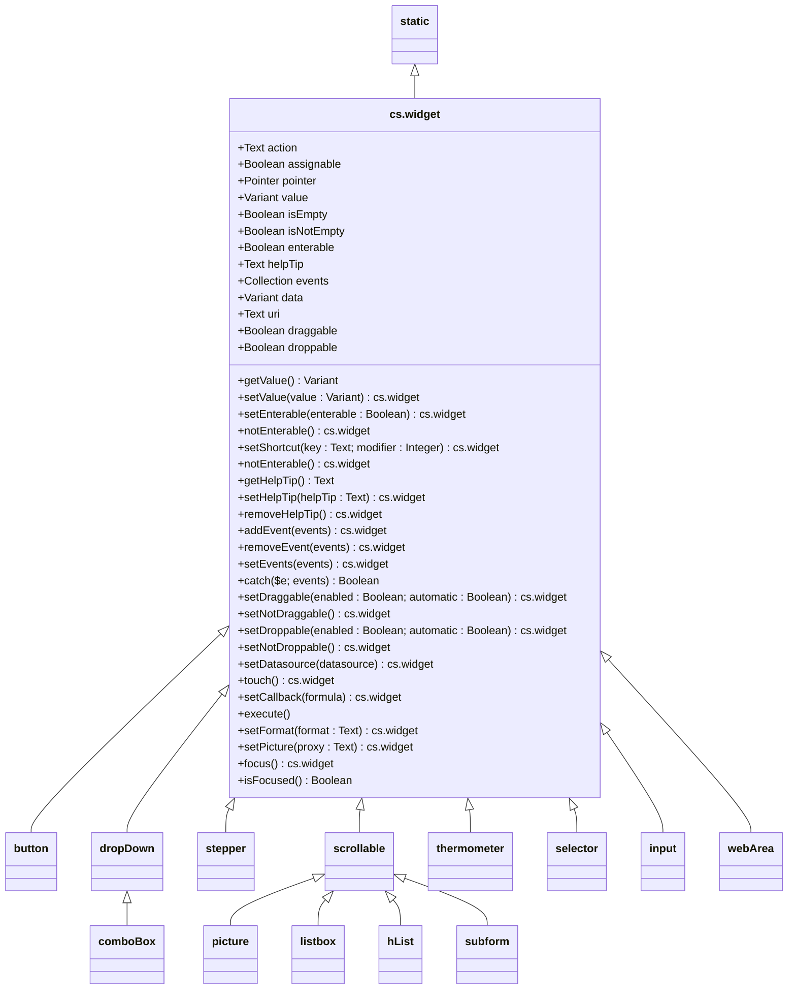

# widget

The `widget` class is intended to manipulate active form objects.  
It's a transition class between the **`static`** class and more specific classes like `input`, `button`, `listbox`…

📌 This class inherit from the [`static`](static.md) class    

#### This class is available via the [`form`](form.md#objects) class as `widget` interface.    

```4D
This.form.widget.new("formObjectName")
```

#### This class can also be instantiated on its own.

```4D
cs.widget.new({"formObjectName"})
```
If the `formObjectName` parameter is ommited, the constructor use the result of **[OBJECT Get name](https://doc.4d.com/4Dv18R6/4D/18-R6/OBJECT-Get-name.301-5198296.en.html)** ( _Object current_ )

> 📌 Omitting the object name can only be used if the constructor is called from the object method.

## Properties

|Properties|Description|Type||
|----------|-----------|:--:|-------|
|**.name** | [*inherited*](static.md) |
|**.type** | [*inherited*](static.md) |
|**.coordinates** | [*inherited*](static.md) |
|**.dimensions** | [*inherited*](static.md) |
|**.windowCoordinates** | [*inherited*](static.md) |

**Other properties are described below in the section devoted to them.**

## Object

|Properties|Description|Type|default|Writable|
|:----------|:-----------|:-----------|:-----------|:-----------:| 
|**.datasource** | Sets the data source for the widget | `4D.Formula` \| `Text Formula` | | <font color="green">X</font>

| Functions | |
|:-------- |:------ |  
|.**setDatasource** ( datasource`:4D.Function`) →`cs.widget` | Sets the data source for the widget

## Value

|Properties|Description|Type|default|Writable|
|:----------|:-----------|:-----------|:-----------|:-----------:| 
|**.value** | The value associated to the widget | `Variant` | | <font color="green">X</font>
|**.isEmpty** | Returns **True** if the widget value is empty\* | `Boolean`
|**.isNotEmpty** | Returns **True** if the widget value is not empty\* | `Boolean`

| Functions | |
|:-------- |:------ | 
|.**clear** () →`cs.widget` | Sets empty value\* to the datasource according to its type
|.**touch** () →`cs.widget` | Forces the update of the widget by reassigning the same value to the data source

\* Empty values are : Null, 0, !00-00-00 !, ?00:00:00 ?, {}, [], False, an empty string or an empty image.

## Entry

|Properties|Description|Type|default|Writable|
|:----------|:-----------|:-----------|:-----------|:-----------:| 
|**.pointer** | Returns a pointer to the widget | `Pointer`
|**.enterable** | Makes the widget enterable or non-enterable | `Boolean` | | <font color="green">X</font>
|**.helpTip** | Returns the associated help message | `Text` | | <font color="green">X</font>

| Functions | |
|:-------- |:------ | 
|.**setEnterable** ({enterable: `Boolean`}) →`cs.widget` | Makes the widget enterable according to enterable parameter<br> Default is **True**
|.**notEnterable** () →`cs.widget` | Makes the widget non-enterable
|.**getShortcut** () →`Object` | Returns the associated shortcut definition <br>`{key (Text), modifier (Integer)}`
|.**setShortcut** (key: `Text` {; modifier: `Integer`}) →`cs.widget` | Sets the associated shortcut
|.**getHelpTip** () →`Text` | Returns the associated help tip
|.**setHelpTip** (helptip: `Text`) →`cs.widget` | Sets the associated help tip. <br>If no parameter , the help tip will be removed.
|.**removeHelpTip** () →`cs.widget` | Removes the associated helptip

## Callback

| Functions | |
|:-------- |:------ | 
|.**setCallback** ( formula: `4D.Formula` \| `Text`}) →`cs.widget` | Associates a callback to be executed when a form event occurs
|.**execute** () | Executes the associates callback

## Events

|Properties|Description|Type|default|Writable|
|:----------|:-----------|:-----------|:-----------|:-----------:| 
|**.events** | The  form event codes of the widget | `Collection`| | <font color="green">X</font>

| Functions | |
|:-------- |:------ | 
|.**catch** ( {e: `Integer` {; events: `Integer` \| `Collection`}}) →`Boolean` | Returns **True** if the widget is causing the form event and executes the `callback` formula if it exists. <br/>Pass an event code or collection of event codes to restrict the response to these events.
|.**addEvent** ( `Integer` \| `Collection`) →`cs.widget` | Appends one or more event codes to the widget
|.**removeEvent** ( `Integer` \| `Collection`) →`cs.widget` | Removes one or more event codes to the widget
|.**setEvents** ( `Integer` \| `Collection`) →`cs.widget` | Sets one or more event codes to the widget

## Attached data

|Properties|Description|Type|default|Writable|
|:----------|:-----------|:-----------|:-----------|:-----------:| 
|**.data** | Any user data you attach to the widget | `Variant`| | <font color="green">X</font>

## Drag & drop

|Properties|Description|Type|default|Writable|
|:----------|:-----------|:-----------|:-----------|:-----------:| 
|**.uri** | The Uniform Resource Identifier associated with the widget | `Text`| | <font color="green">X</font>

## Actions

|Properties|Description|Type|default|Writable|
|:----------|:-----------|:-----------|:-----------|:-----------:| 
|**.action** | The name of the [Standard actions](https://doc.4d.com/4Dv20/4D/20.1/Standard-Action.302-6481063.en.html) associated with the widget | `Text` | |<font color="green">X</font>
|**.draggable** | The dragging option | `Boolean`| | <font color="green">X</font>
|**.droppable** | The drop-off option | `Boolean`| | <font color="green">X</font>

| Functions | |
|:-------- |:------ | 
|.**setDraggable** ( enable: `Boolean` {; automatic : `Boolean`}) →`cs.widget` | Sets the drag options
|.**setNotDraggable** () →`cs.widget` | Disables drag option
|.**setDroppable** ( enable: `Boolean` {; automatic : `Boolean`}) →`cs.widget` | Sets the drop options<br/> Default: accept drop and not automatic
|.**setNotDroppable** () →`cs.widget` | Disables the droppable option

## Miscellaneous

|Properties|Description|Type|default|Writable|
|:----------|:-----------|:-----------|:-----------|:-----------:| 
|**.pointer** | Returns the pointer to the widget |`Pointer` | ⚠️ Nil pointer if data source is an expression

| Functions | |
|:-------- |:------ | 
|.**focus** () →`cs.widget` | Gives focus to the widget |
|.**isFocused** () →`Boolean` | Returns **True** if the widget is focused |
|.**setFormat** (format: `Text`) →`cs.widget` | Sets the format for the widget |
|.**setPicture** (proxy: `Text`) →`cs.widget` | Attaches an image to the widget - *cf*. *infra* |


> 📌 All functions that return `cs.widget` may include one call after another. 

## 🔹 .setPicture()
.**setPicture** ({ proxy: `Text`} ) →`cs.widget`

This function is intended to set the image of the compatible `3D button`, `3D checkbox`, `3D radio button`, `picture button`, `picture popup menu`, `listbox header` or `static picture`.

Possible values for the `proxy` parameter are:

* The string `#{folder/}picturename` or `file:{folder/}picturename` if the picture comes from a file stored in the `Resources` folder
* A variable name if the picture comes from a `picture variable`

If the `proxy` parameter is omitted, the picture is removed

## Class diagram


